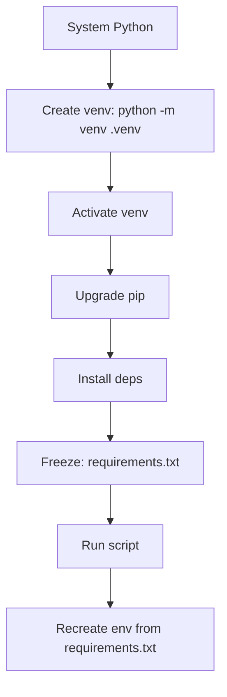
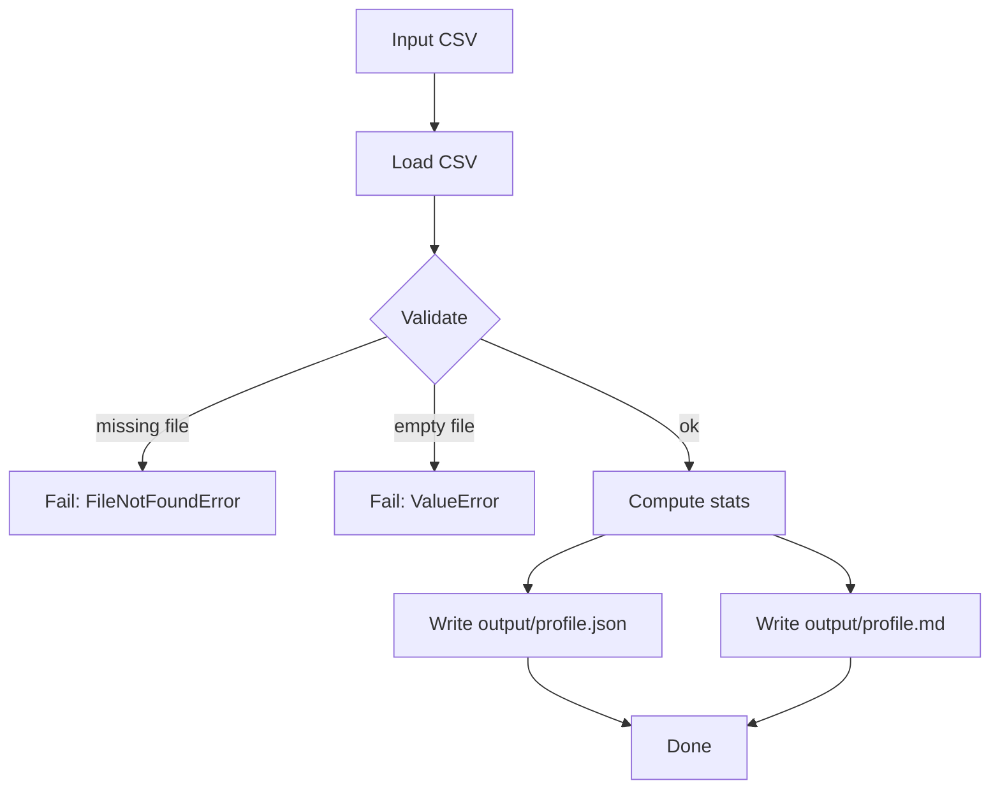

# Level 1 — Week 1: Environment Setup & Data Processing Basics

## Pre-study (Level 0)

Level 1 assumes Level 0 is complete. If you need a refresher:

- [Pre-study index (Level 1 → Level 0)](../PRESTUDY.md)
- [Level 0 — Chapter 1: Tool Preparation](../../level_0/Chapters/1/Chapter1.md)
- [Level 0 — Chapter 2: Python and Environment Management](../../level_0/Chapters/2/Chapter2.md)

## What you should be able to do by the end of this week

- Create a clean Python environment and install dependencies reliably.
- Run a project from a README on a fresh machine (or a fresh folder).
- Build a small “data profiling” script that reads a CSV and produces reproducible outputs.

Tutorials:
 
- [tutorial.md](tutorial.md)
- [01_environment_setup.md](01_environment_setup.md)
- [02_data_profiling_script.md](02_data_profiling_script.md)

Practice notebook: [practice.ipynb](practice.ipynb)

## Key Concepts (Level 0 refresher)

Level 1 assumes you already learned the fundamentals in Level 0. If you need a refresher for this week:

- Environment management (conda/venv):
  - ../../level_0/Chapters/2/03_conda_environments.md
  - ../../level_0/Chapters/1/04_conda_environment_management.md
- Jupyter basics:
  - ../../level_0/Chapters/1/05_jupyter_interactive_computing.md
- Modules, exception handling, and JSON/file I/O patterns:
  - ../../level_0/Chapters/2/02_modules_exceptions.md

## Common pitfalls

- Running `pip install ...` outside your environment.
- Not pinning dependencies (or not recording them anywhere).
- Only sharing screenshots of errors instead of copy/paste logs.
- Writing outputs to random locations (hard to reproduce).

## Workshop / Implementation Plan

- Create environment and install dependencies.
- Implement `data_profile.py`:
  - input: `--input path/to.csv`
  - output: write files to `output/`
  - include clear errors for missing file / empty file / missing columns

## Figures (Comprehensive Overviews — Leave Blank)

### Figure A: Environment setup flow (Python -> venv -> install -> run)

### Figure B: Data profiling pipeline (read -> validate -> stats -> export)

## Self-check questions

- Can you explain the difference between a virtual environment and the system Python?
- Can you re-run your script and get the same output files from the same input?
- If someone else runs your README steps, do they succeed without extra “secret” steps?
