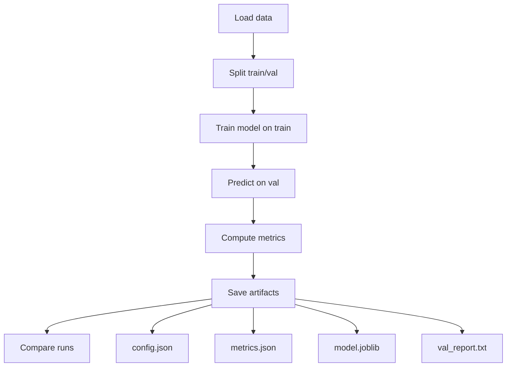

# Level 1 — Week 2: The ML Training Loop + Reproducible Baselines

## Pre-study (Level 0)

Level 1 assumes Level 0 is complete. If you need a refresher:

- [Pre-study index (Level 1 → Level 0)](../PRESTUDY.md)
- [Level 0 — Chapter 2: Python and Environment Management](../../level_0/Chapters/2/Chapter2.md)

## What you should be able to do by the end of this week

- Explain why we split data into train/validation.
- Train a baseline model, evaluate it, and save artifacts.
- Compare two runs and write a short failure retrospective.

Tutorials:
 
- [tutorial.md](tutorial.md)
- [01_training_loop.md](01_training_loop.md)
- [02_reproducibility_package.md](02_reproducibility_package.md)
- [03_compare_runs_report.md](03_compare_runs_report.md)

Practice notebook: [practice.ipynb](practice.ipynb)

## Key Concepts (Level 0 refresher)

Level 1 assumes you already learned the fundamentals in Level 0. If you need a refresher for this week:

- Reproducible environments, dependencies, and basic Python project habits:
  - ../../level_0/Chapters/2/Chapter2.md
- Evaluation mindset and metrics (accuracy/precision/recall/F1):
  - ../../level_0/Chapters/4/02_core_concepts.md

## Common pitfalls

- Evaluating on training data.
- Changing multiple variables at once (you can’t tell what caused improvement).
- Not saving the exact config that produced the metrics.

## Workshop / Implementation Plan

- Implement `train.py`:
  - load data
  - split train/validation
  - train a baseline classifier
  - print metrics
  - save artifacts
- Run 2 experiments:
  - change one hyperparameter OR switch models
- Write `report.md`:
  - what you changed
  - what happened
  - one failed run + your next experiment idea

## Figures (Comprehensive Overviews — Leave Blank)

### Figure A: The ML training loop (split -> train -> evaluate -> save)



### Figure B: Overfitting intuition (training vs validation curves)

```mermaid
flowchart LR
  A[Start training]
  A --> B[Train metric increases steadily]
  A --> C[Val metric increases at first]
  C --> D[Val metric peaks]
  D --> E[Val metric declines (overfitting)]
  B --> F[High train / lower val gap]
```

## Self-check questions

- Can you explain overfitting without using equations?
- If someone runs your command twice, will results be identical or explainably close?
- Can you point to the saved artifact that proves your reported metric?
