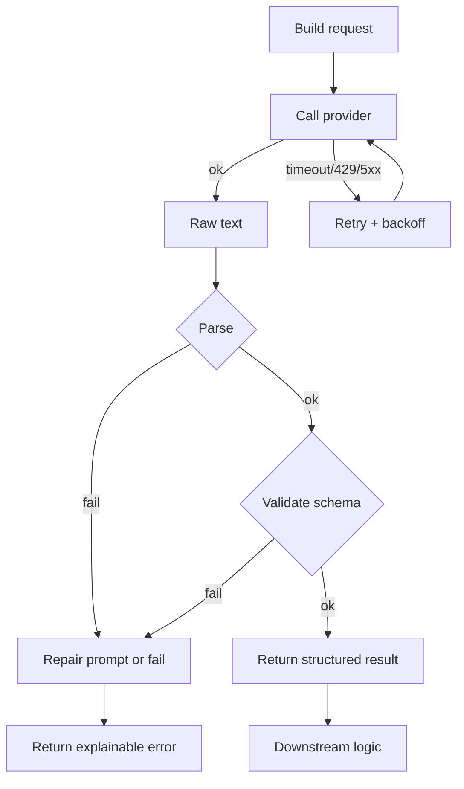
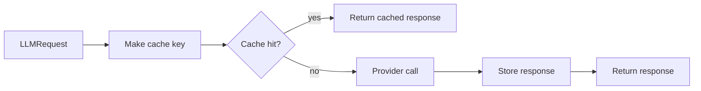

# Level 1 — Week 4: LLM API Engineering (Reliability & Cost)

## What you should be able to do by the end of this week

- Implement an `llm_client.py` that is safe to reuse across projects.
- Explain why timeouts/retries/rate limits/caching exist.
- Add logging that helps you debug failures quickly.

Tutorials:
 
- [tutorial.md](tutorial.md)
- [01_timeouts_failures.md](01_timeouts_failures.md)
- [02_retries_backoff_idempotency.md](02_retries_backoff_idempotency.md)
- [03_rate_limiting.md](03_rate_limiting.md)
- [04_caching_logging.md](04_caching_logging.md)
- [05_llm_client_skeleton.md](05_llm_client_skeleton.md)

Practice notebook: [practice.ipynb](practice.ipynb)

## Key Concepts (with explanations + citations)

### 1) Timeouts (always set them)

**Mental model**:

- Without a timeout, your program can hang indefinitely.
- Timeouts turn “unknown waiting” into a controlled failure.

Citations:

- `requests` timeouts: https://requests.readthedocs.io/en/latest/user/quickstart/#timeouts

### 2) Retries and backoff

**Mental model**:

- Some failures are transient (network hiccups, temporary overload).
- Retrying immediately can make overload worse; backoff helps.

Citations:

- Tenacity: https://tenacity.readthedocs.io/

### 3) Rate limiting

**Mental model**:

- Providers protect their systems and enforce fairness.
- You need graceful behavior:
  - wait + retry
  - or degrade (fallback)

Citations:

- HTTP 429 Too Many Requests (MDN): https://developer.mozilla.org/en-US/docs/Web/HTTP/Status/429

### 4) Idempotency (safe retries)

**Mental model**:

- Retrying should not create duplicated side effects.
- Even if your project is “just inference”, this concept becomes critical in real systems.

Citations:

- Stripe idempotency (conceptual best practice): https://stripe.com/docs/idempotency

### 5) Caching (cost and latency)

**Mental model**:

- If the exact same request happens often, caching avoids re-paying cost.
- Cache keys must include everything that affects output:
  - prompt
  - model
  - temperature
  - system instructions

Citations:

- `functools.lru_cache`: https://docs.python.org/3/library/functools.html#functools.lru_cache

### 6) Observability basics (logging)

**Mental model**:

- A minimal “request log” should tell you:
  - request id
  - model
  - latency
  - success/failure
  - where it failed (provider call vs parsing)

Citations:

- Python logging: https://docs.python.org/3/library/logging.html

## Workshop / Implementation Plan

- Implement `llm_client.py` with:
  - timeouts
  - retries + backoff
  - rate limit handling
  - simple caching
  - logs
- Add tests or a manual failure checklist:
  - forced timeout
  - forced invalid JSON

## Figures (Comprehensive Overviews — Leave Blank)

### Figure A: Reliable LLM call lifecycle (request -> retry -> parse -> validate)

### Figure B: Cache flow (request -> cache hit/miss -> provider)

## Self-check questions

- Can you show your client does not hang forever?
- Can you simulate failures and show graceful handling?
- Can you explain what information your logs provide during an incident?
