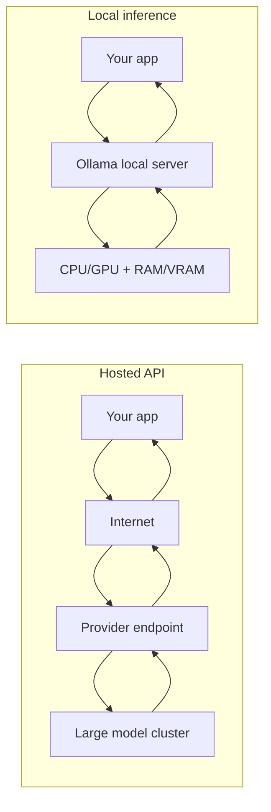
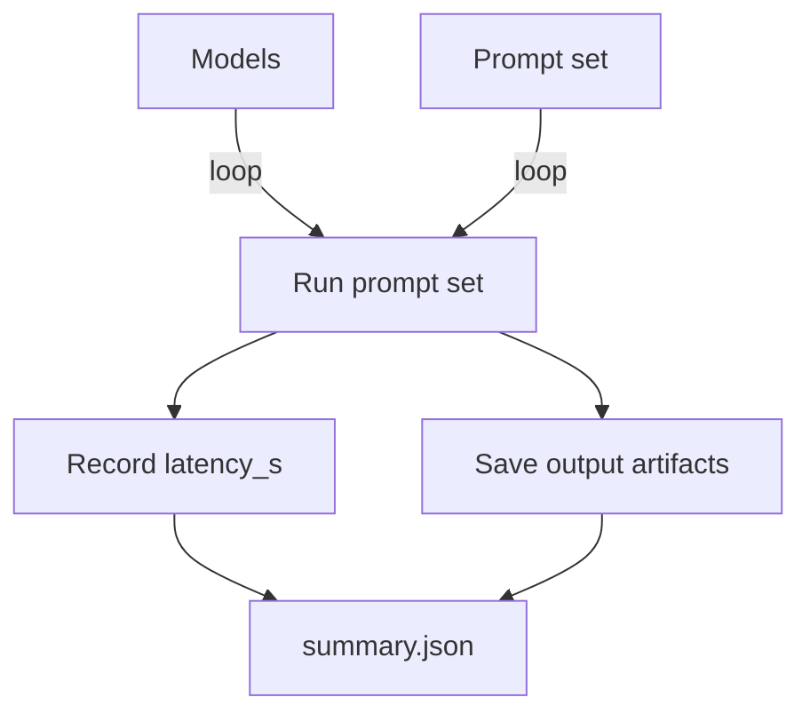

# Level 1 — Week 5: Local Inference (Ollama) and Model Comparison

## What you should be able to do by the end of this week

- Run at least one model locally using Ollama.
- Compare 2–3 models on the same task using a consistent benchmark script.
- Explain the practical constraints: speed, memory (VRAM/RAM), context limits, and output quality.

Tutorials:
 
- [tutorial.md](tutorial.md)
- [01_local_inference_setup.md](01_local_inference_setup.md)
- [02_ollama_http_client.md](02_ollama_http_client.md)
- [03_benchmarking_script.md](03_benchmarking_script.md)

Practice notebook: [practice.ipynb](practice.ipynb)

## Key Concepts (with explanations + citations)

### 1) What “local inference” means

**Mental model**:

- “Inference” is using a trained model to generate outputs (no training happens).
- “Local inference” means the model runs on your machine instead of a hosted API.

**Why local inference is useful**:

- Privacy: sensitive data can stay on-device.
- Cost: no per-call API billing (but you pay compute).
- Offline capability.

**Common trade-offs**:

- Quality: local models may be smaller/less capable.
- Hardware limits: large models may not fit in VRAM.
- Latency: depends heavily on your hardware and model size.

Citations:

- Ollama (official site): https://ollama.com/
- Ollama GitHub (docs/issues): https://github.com/ollama/ollama

### 2) Model selection basics (size, context window, quantization)

**Mental model**:

- Larger models usually improve reasoning/fluency, but cost more compute.
- Context window affects how much text you can send in one request.
- Some local models are distributed in quantized formats to reduce memory usage.

If quantization details are too math-heavy, focus on the practical effect: **smaller memory footprint can make local models usable**.

Citations:

- Hugging Face model cards (overview): https://huggingface.co/docs/hub/model-cards

### 3) Benchmarking: quality and latency

**Mental model**:

- A good benchmark uses:
  - the same prompts
  - the same test set
  - the same measurement method
- Compare:
  - latency (average and tail)
  - output quality (human inspection + simple heuristics)

Citations:

- Python `timeit` (official): https://docs.python.org/3/library/timeit.html
- Python `time` (official): https://docs.python.org/3/library/time.html

## Workshop / Implementation Plan

- Install Ollama and run one model successfully.
- Implement `benchmark_local_llm.py`:
  - define a small prompt set (5–20 items)
  - run each prompt on each model
  - record latency and store outputs
- Write a short conclusion:
  - best model for quality
  - best model for speed
  - “best-fit scenarios” (when you would choose each)

## Figures (Comprehensive Overviews — Leave Blank)

### Figure A: Hosted API vs local inference (cost, privacy, latency)

### Figure B: Benchmark summary table (models x prompts -> metrics)

## Self-check questions

- Can you run the same benchmark twice and get comparable latency distributions?
- Can you justify why one model is “best” for a specific use case?
- What is the biggest limiting factor on your machine (RAM, VRAM, CPU/GPU)?
