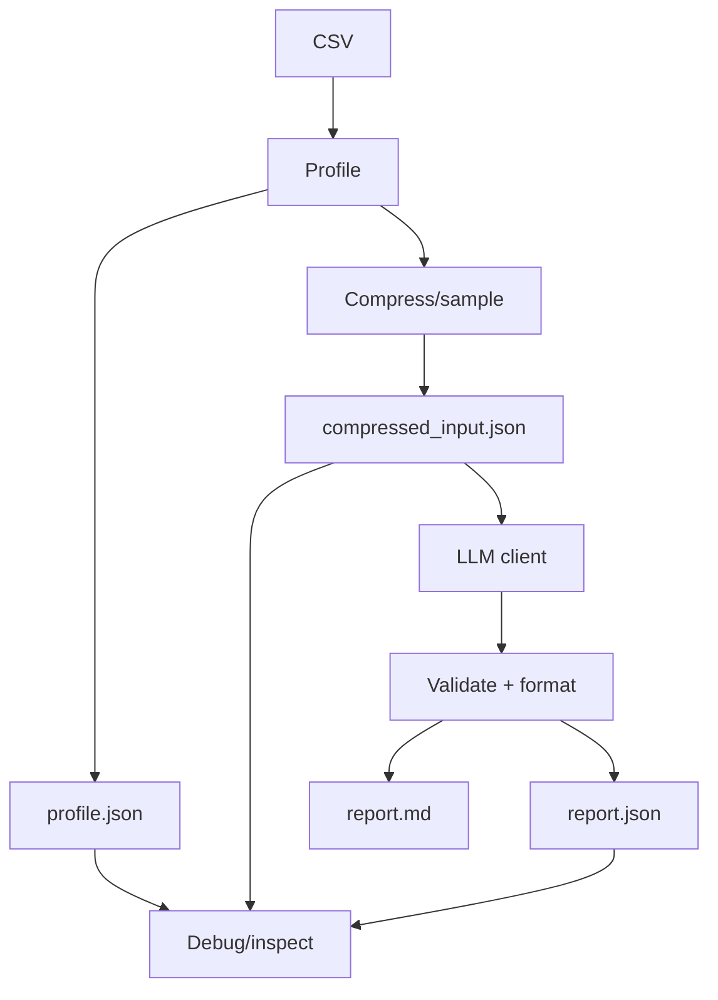
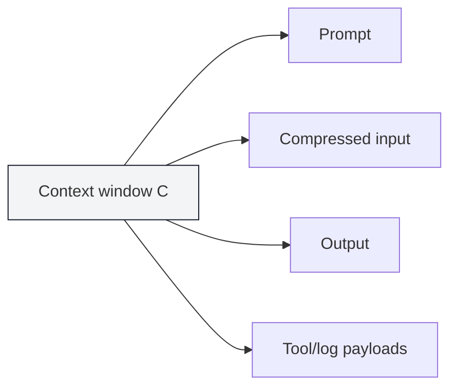

# Level 1 — Week 6: Capstone Prototype (End-to-End Flow)

## What you should be able to do by the end of this week

- Implement the Capstone “happy path” end-to-end.
- Keep prompts within limits by sampling/compressing inputs.
- Produce stable artifacts: `report.json` and `report.md`.

Tutorials:
 
- [tutorial.md](tutorial.md)
- [01_pipeline_design.md](01_pipeline_design.md)
- [02_sampling_compression.md](02_sampling_compression.md)
- [03_chunking_synthesis.md](03_chunking_synthesis.md)
- [04_capstone_runner.md](04_capstone_runner.md)

Practice notebook: [practice.ipynb](practice.ipynb)

## Key Concepts (with explanations + citations)

### 1) From scripts to pipelines

**Mental model**:

- A pipeline is a sequence of stages where each stage has:
  - inputs
  - outputs
  - clear responsibilities

**Why it matters**:

- Debugging is easier when you can isolate which stage failed.
- Reproducibility improves when each stage saves intermediate outputs.

Citations:

- Twelve-Factor App (logs/config mindset): https://12factor.net/

### 2) Sampling and input compression

**Mental model**:

- Real datasets can be large; you often cannot send the full table to an LLM.
- You can still get useful analysis by combining:
  - descriptive statistics (counts, means, missing values)
  - representative samples
  - detected anomalies

Citations:

- Pandas sampling: https://pandas.pydata.org/docs/reference/api/pandas.DataFrame.sample.html

### 3) Chunking / splitting long text

**Mental model**:

- When text is too long:
  - split into chunks
  - process chunks
  - synthesize a summary

Even if you don’t adopt a framework, the pattern is important.

Citations:

- LangChain text splitters (reference): https://python.langchain.com/docs/how_to/#text-splitters

### 4) Stable schemas and deterministic outputs

**Mental model**:

- Your code needs stable machine-readable outputs even if the model is “creative”.
- Stability comes from:
  - explicit schemas
  - validation
  - retries/repair
  - deterministic formatting of the final JSON

Citations:

- JSON Schema (official): https://json-schema.org/
- Python `json` (official): https://docs.python.org/3/library/json.html

## Workshop / Implementation Plan

- Implement the full flow:
  - CSV -> profiling
  - sampling/compression
  - LLM call (using your `llm_client.py`)
  - build `report.json` + `report.md`
- Ensure the entire pipeline runs with one command.

## Figures (Comprehensive Overviews — Leave Blank)

### Figure A: End-to-end Capstone pipeline (CSV -> profile -> sample -> LLM -> report)

### Figure B: Context budget diagram (what consumes tokens)

## Self-check questions

- Can you identify which stage fails when something breaks?
- Can you re-run and get stable `report.json` fields?
- Do you save intermediate outputs to help debugging?
