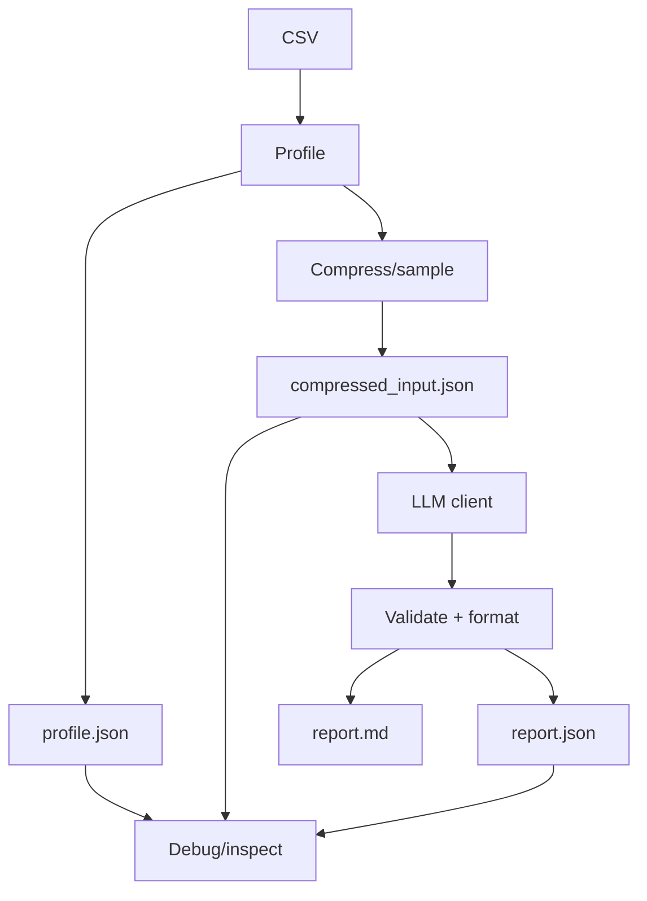
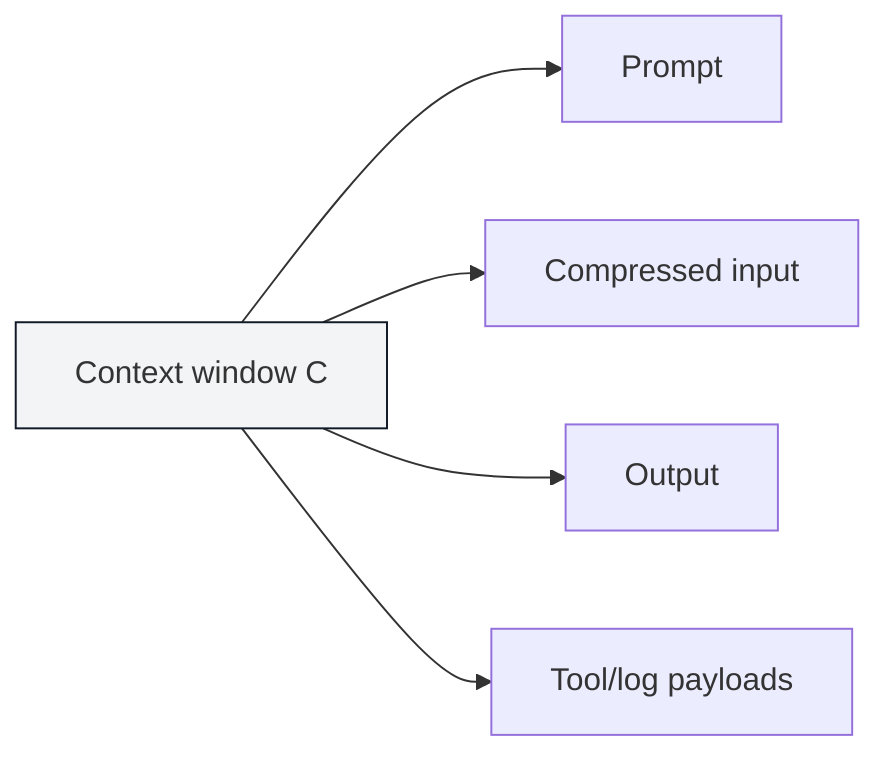

# Level 1 — Week 6: Capstone Prototype (End-to-End Flow)

## Pre-study (Level 0)

Level 1 assumes Level 0 is complete. If you need a refresher:

- [Pre-study index (Level 1 → Level 0)](../PRESTUDY.md)
- [Level 0 — Chapter 3: AI Engineering Fundamentals](../../level_0/Chapters/3/Chapter3.md)

## What you should be able to do by the end of this week

- Implement the Capstone “happy path” end-to-end.
- Keep prompts within limits by sampling/compressing inputs.
- Produce stable artifacts: `report.json` and `report.md`.

Tutorials:
 
- [tutorial.md](tutorial.md)
- [01_pipeline_design.md](01_pipeline_design.md)
- [02_sampling_compression.md](02_sampling_compression.md)
- [03_chunking_synthesis.md](03_chunking_synthesis.md)
- [04_capstone_runner.md](04_capstone_runner.md)

Practice notebook: [practice.ipynb](practice.ipynb)

## Key Concepts (Level 0 refresher)

Level 1 assumes you already learned the fundamentals in Level 0. If you need a refresher for this week:

- Pipeline and artifact mindset (inputs/outputs/contracts):
  - ../../level_0/Chapters/3/Chapter3.md

## Workshop / Implementation Plan

- Implement the full flow:
  - CSV -> profiling
  - sampling/compression
  - LLM call (using your `llm_client.py`)
  - build `report.json` + `report.md`
- Ensure the entire pipeline runs with one command.

## Figures (Comprehensive Overviews — Leave Blank)

### Figure A: End-to-end Capstone pipeline (CSV -> profile -> sample -> LLM -> report)

### Figure B: Context budget diagram (what consumes tokens)

## Self-check questions

- Can you identify which stage fails when something breaks?
- Can you re-run and get stable `report.json` fields?
- Do you save intermediate outputs to help debugging?
