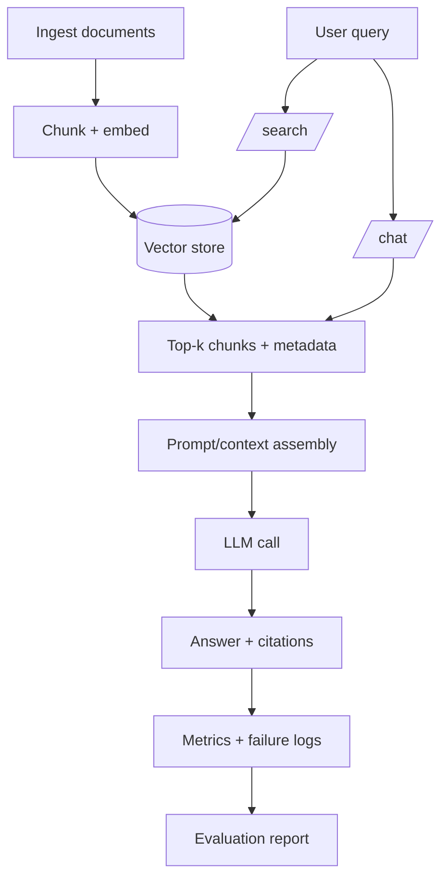

# Level 2 — Week 1: From Requirements to Architecture (AI Application System View)

## What you should be able to do by the end of this week

- Turn a product requirement into a minimal service architecture (modules + contracts).
- Run a FastAPI service locally with configuration, logging, and a health check.
- Define request/response models and error behavior (status codes + error payloads).

Tutorials:
 
- [tutorial.md](tutorial.md)
- [01_requirements_to_architecture.md](01_requirements_to_architecture.md)
- [02_fastapi_service_skeleton.md](02_fastapi_service_skeleton.md)
- [03_error_handling_request_ids.md](03_error_handling_request_ids.md)

## Key Concepts (with explanations + citations)

### 1) Requirements -> architecture -> API contract

**Mental model**:

- A requirement becomes a set of capabilities, constraints, and failure modes.
- An API contract is the external interface: endpoints, schemas, and error behavior.
- Architecture is about boundaries: what happens in ingestion vs retrieval vs generation.

**How to teach it (lecture outline)**:

- Translate a requirement into:
  - user journeys (happy path)
  - admin journeys (ingest/update)
  - failure journeys (empty KB, timeouts, bad input)
- Convert journeys into a small set of endpoints:
  - `/health` (service readiness)
  - `/search` (retrieval as a debuggable component)
  - `/chat` (generation on top of retrieval)
- Make the boundaries explicit:
  - ingestion writes data (side effects)
  - retrieval reads data (query path)
  - generation consumes retrieval output (LLM path)

**Key idea**:

- If you cannot write a request/response example, you do not have a stable contract yet.

Citations:

- https://developer.mozilla.org/en-US/docs/Web/HTTP/Status
- https://fastapi.tiangolo.com/
- https://docs.pydantic.dev/latest/
- https://spec.openapis.org/oas/latest.html
- https://sre.google/sre-book/service-level-objectives/

### 2) Service skeleton: config, logs, health checks

**Mental model**:

- A service must be runnable from a clean machine using README steps.
- Logs should tell you what happened; health checks tell you if it is alive/ready.
- Configuration should come from environment variables or config files, not hardcoded secrets.

Practical definitions:

- **Liveness**: “is the process up and responding to HTTP?” (cheap, should not depend on external services)
- **Readiness**: “are required dependencies available?” (vector store, required env vars)

**What “runnable” means in practice**:

- A new learner should be able to:
  - create an environment
  - set `.env` variables
  - run one command to start the API
  - call `/health` and see `ok`

**Operational minimum**:

- Define two health concepts:
  - liveness: process is running
  - readiness: dependencies are available (vector DB, model keys)
- Treat configuration as a typed interface:
  - centralize config in a settings object
  - validate required environment variables at startup (fail fast)
- Standardize log fields early:
  - timestamp
  - level
  - request_id
  - component (ingest/retrieve/chat)

Citations:

- https://fastapi.tiangolo.com/
- https://fastapi.tiangolo.com/tutorial/middleware/
- https://docs.python.org/3/library/logging.html
- https://github.com/theskumar/python-dotenv
- https://12factor.net/
- https://www.uvicorn.org/

### 3) Error handling and debuggability

**Mental model**:

- Prefer explicit validation errors over silent failures.
- Return actionable error messages (what was wrong + how to fix).
- Add request IDs so one request can be traced across logs.

**Error behavior to standardize early**:

- Input validation errors:
  - return 4xx
  - include which field failed and why
- In FastAPI, schema validation failures are commonly returned as **422** (valid JSON, invalid schema), while malformed requests are **400**.
- System errors:
  - return 5xx
  - include a request_id and a short message
  - log the full stack trace server-side

**Request IDs**:

- Generate a request ID at the edge (middleware).
- If the client already sends `x-request-id`, accept it and propagate it (don’t overwrite it).
- Propagate it through:
  - logs
  - downstream tool calls
  - evaluation outputs

Citations:

- https://docs.pydantic.dev/latest/
- https://docs.python.org/3/tutorial/errors.html
- https://developer.mozilla.org/en-US/docs/Web/HTTP/Status
- https://www.w3.org/TR/trace-context/

## Common pitfalls

- Starting to code without agreeing on an API contract (schemas + error behavior).
- Not having a single happy-path command to run the service.
- No request IDs, so logs are hard to search.

## Workshop / Implementation Plan

- Define endpoints: `/health`, `/search` (placeholder), `/chat` (placeholder).
- Add config loading via `.env` (do not hardcode secrets).
- Add request/response models and one example request/response in README.

## Figures (Comprehensive Overviews — Leave Blank)

### Figure A: System architecture overview

```mermaid
flowchart LR
  U[Client (curl/UI)] --> API[FastAPI service]

  API --> H[/health/]
  API --> S[/search/]
  API --> C[/chat/]

  API --> CFG[Config (.env)]
  API --> LOG[Structured logs + request_id]

  subgraph Core[Core modules]
    RET[retrieval module]
    GEN[generation module]
    EVAL[eval script/job]
  end

  S --> RET
  C --> RET
  C --> GEN
  EVAL --> RET
  EVAL --> GEN
```

### Figure B: Data and control flow (ingestion -> retrieval -> generation -> evaluation)



## Self-check questions

- Can you write the API contract (request/response schemas) without looking at code?
- If the service returns an error, do you know where to look in logs first?
