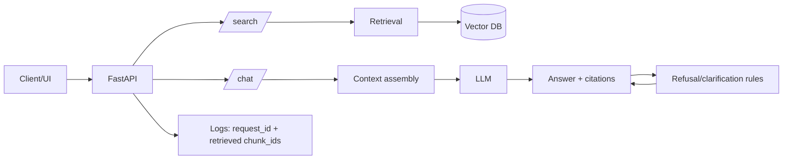
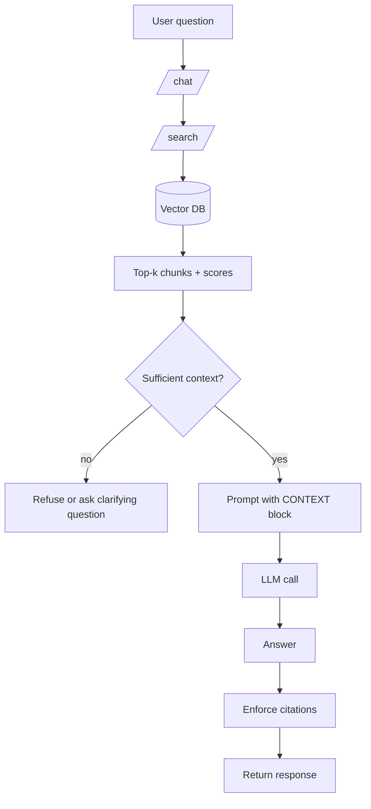

# Level 2 — Week 4: RAG v1 (Chat + Citations + Refusal/Clarification)

## What you should be able to do by the end of this week

- Build `/chat` on top of retrieval results and enforce citations (source + snippet).
- Implement refusal/clarification when retrieved context is insufficient.
- Define what counts as “in-KB” vs “out-of-KB” for your domain.

Tutorials:
 
- [tutorial.md](tutorial.md)
- [01_context_assembly_grounding.md](01_context_assembly_grounding.md)
- [02_citations_enforcement.md](02_citations_enforcement.md)
- [03_refusal_clarification.md](03_refusal_clarification.md)
- [04_chat_endpoint_contract.md](04_chat_endpoint_contract.md)

Practice notebook: [practice.ipynb](practice.ipynb)

## Key Concepts (with explanations + citations)

### 1) Context assembly and grounding

**Mental model**:

- The model should answer from retrieved context, not from “general knowledge”.
- Citations make answers auditable and help users trust the output.

**How to teach it (lecture outline)**:

- Start with the failure you are preventing:
  - the model produces a fluent answer that is not supported by your KB
- Show the RAG control lever:
  - you control what context goes into the prompt
  - you control how the answer must reference that context

**Practical pattern (recommended)**:

- Build a prompt that has:
  - a short task instruction
  - a `CONTEXT` block containing retrieved chunks
  - explicit output rules: citations required, no unsupported claims
- Keep the context structured:
  - each chunk has `doc_id`, `chunk_id`, and `text`

**What to log**:

- retrieval query
- retrieved chunk IDs + scores
- the exact chunks passed to the model (or a hash)

Citations:

- https://www.pinecone.io/learn/retrieval-augmented-generation/
- https://docs.trychroma.com/

### 2) Refusal/clarification (control behavior)

**Mental model**:

- If retrieved context is insufficient, refuse or ask a clarifying question.
- Define “insufficient” with simple rules (e.g., low similarity / empty retrieval / missing required fields).

**Define a deterministic rule first (before prompting tricks)**:

- If no chunks retrieved: refuse or ask for more details
- If top score is below a threshold: ask a clarifying question
- If chunks conflict: ask clarifying question or present both with citations

**Teach “refusal vs clarification”**:

- Refusal:
  - user asks something out-of-domain or not in KB
  - answer would be risky without evidence
- Clarification:
  - the KB might contain the answer, but the query is underspecified

**Make it testable**:

- Add 5–10 test questions and classify them:
  - in-KB
  - ambiguous
  - out-of-KB

Citations:

- https://developer.mozilla.org/en-US/docs/Web/HTTP/Status
- https://developer.mozilla.org/en-US/docs/Web/HTTP/Status/422

## Common pitfalls

- Citations that are not traceable to actual text snippets.
- Always answering even when retrieval is empty (hallucination risk).

## Workshop / Implementation Plan

- Implement `/chat` that uses `/search` output as context.
- Enforce citations and implement refusal/clarification.
- Add 5 test questions covering in/out-of-KB.

## Figures (Comprehensive Overviews — Leave Blank)

### Figure A: System architecture overview

### Figure B: Data and control flow (ingestion -> retrieval -> generation -> evaluation)

## Self-check questions

- Are citations traceable to actual snippets in the KB?
- Does your system refuse or ask for clarification when context is missing?
