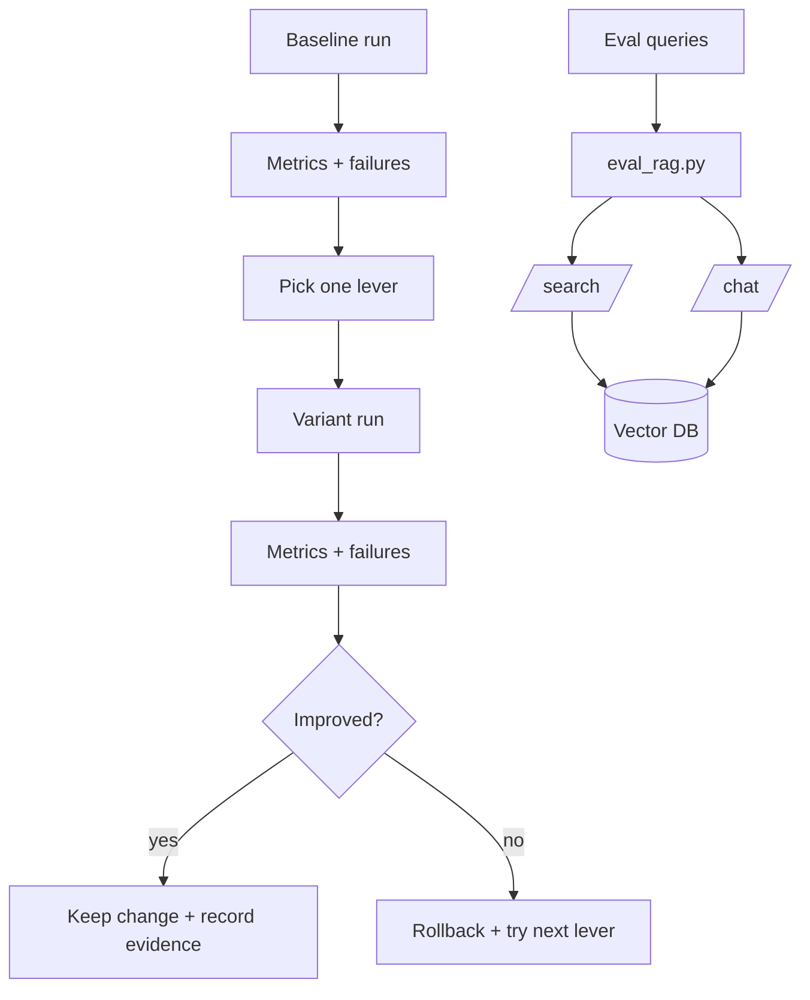

# Level 2 — Week 5: RAG Quality Iteration + Minimal Evaluation (Compressed)

## What you should be able to do by the end of this week

- Run one controlled quality iteration (chunking/embeddings, optional rerank/query rewrite).
- Create a minimal evaluation set (10–20 items) and a reproducible eval script.
- Record failure cases and show a before/after improvement for at least one metric.

Tutorials:
 
- [tutorial.md](tutorial.md)
- [01_controlled_iteration.md](01_controlled_iteration.md)
- [02_eval_set_design.md](02_eval_set_design.md)
- [03_eval_script_failure_analysis.md](03_eval_script_failure_analysis.md)

Practice notebook: [practice.ipynb](practice.ipynb)

## Key Concepts (with explanations + citations)

### 1) Controlled iteration (one variable at a time)

**Mental model**:

- Change one thing (chunk size, overlap, embedding model, rerank) and compare.
- Record failure cases and keep a baseline for rollbacks.

**How to run a controlled experiment (teach as a checklist)**:

- Freeze everything except one variable:
  - chunk size/overlap
  - embedding model
  - top_k
  - rerank on/off
- Keep the same:
  - query set
  - evaluation set
  - prompt template

**Output artifacts to require**:

- a run ID
- config used (json/yaml)
- metrics summary
- top 5 failures with evidence

Citations:

- https://www.pinecone.io/learn/retrieval-augmented-generation/
- https://12factor.net/

### 2) Minimal evaluation loop

**Mental model**:

- Evaluation turns subjective quality into repeatable signals.
- Start small: 10–20 items and a script that prints metrics and failures.

**What to measure (minimum viable)**:

- Retrieval-level:
  - hit rate / recall@k on your query set
- Answer-level:
  - citation coverage (does each answer include citations?)
  - refusal correctness (did out-of-KB refuse?)
  - format validity (JSON schema / required fields)

**How to design the 10–20 item eval set**:

- 50% obvious in-KB
- 30% “near-miss” (requires correct chunk)
- 20% out-of-KB (should refuse/clarify)

**Teach failure analysis**:

- For each failure, label the root cause:
  - retrieval miss
  - context too noisy
  - prompt ambiguous
  - model ignored citation rule

Citations:

- https://docs.python.org/3/library/logging.html
- https://nlp.stanford.edu/IR-book/html/htmledition/evaluation-in-information-retrieval-1.html

## Common pitfalls

- Changing many variables at once, making it unclear what helped.
- No eval script, so results cannot be reproduced.

## Workshop / Implementation Plan

- Pick one improvement lever and test it (chunk size/overlap, embeddings, optional rerank).
- Build a minimal eval set (10–20) and `eval_rag.py`.
- Record before/after metrics and failures.

## Figures (Comprehensive Overviews — Leave Blank)

### Figure A: System architecture overview

```mermaid
flowchart LR
  CFG[Run config(chunking/top_k/embeddings)] --> RUN[Experiment run_id]
  RUN --> ING[Index build]
  ING --> V[(Vector DB)]

  QSET[Eval set] --> EVAL[eval_rag.py]
  EVAL --> API[/search + /chat]
  API --> V
  EVAL --> MET[Metrics + failures]
  MET --> REP[Report (before/after)]
```

### Figure B: Data and control flow (ingestion -> retrieval -> generation -> evaluation)



## Self-check questions

- Can you show before/after evidence for one improvement?
- Can another person run your eval script and see the same results?
