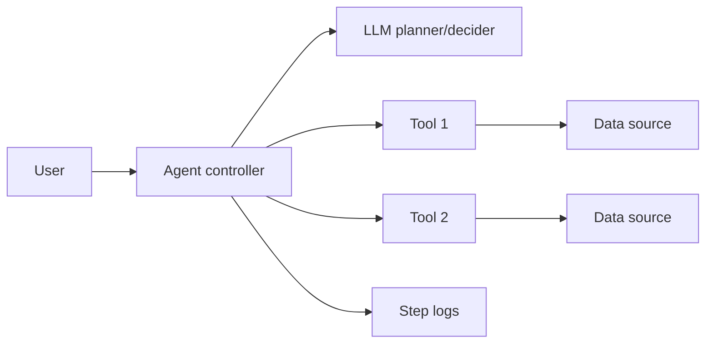
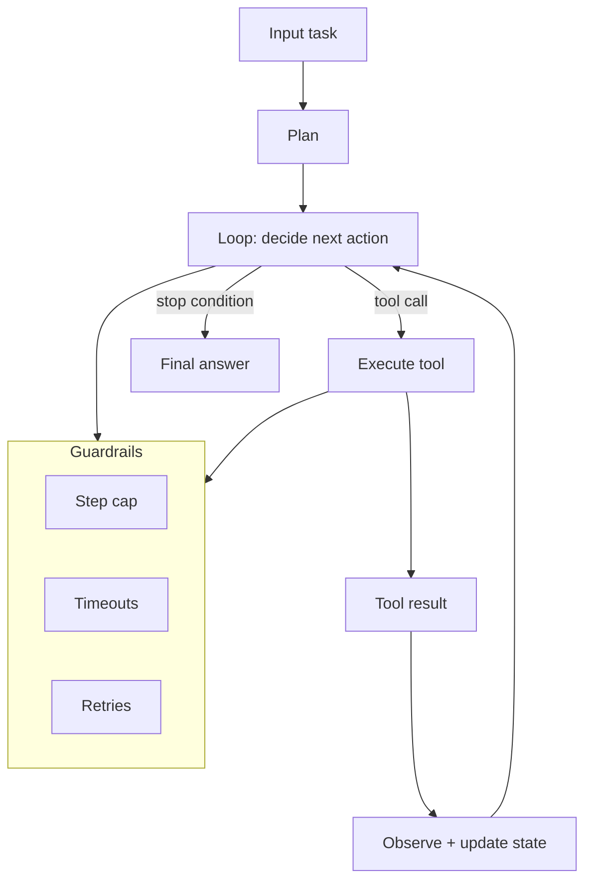

# Level 2 — Week 6: Agent Foundations (Tool Calling, State, and Reliability)

## What you should be able to do by the end of this week

- Explain what an agent is (beyond a single prompt) and why the loop matters.
- Implement an agent that calls at least two tools with typed inputs/outputs.
- Add reliability behaviors: timeouts, retries, fallbacks, and structured step logs.

Tutorials:
 
- [tutorial.md](tutorial.md)
- [01_agent_loop_state.md](01_agent_loop_state.md)
- [02_tool_contracts.md](02_tool_contracts.md)
- [03_reliability_step_logs.md](03_reliability_step_logs.md)
- [04_agent_v1_blueprint.md](04_agent_v1_blueprint.md)

Practice notebook: [practice.ipynb](practice.ipynb)

## Key Concepts (with explanations + citations)

### 1) Agent loop and state

**Mental model**:

- An agent is a controller that repeatedly plans, calls tools, observes outputs, and decides next steps.
- State should be explicit: inputs, intermediate results, and final output.

**How to teach “agent vs prompt”**:

- Prompting:
  - one-shot input -> one-shot output
- Agent:
  - multi-step loop
  - tool usage
  - state transitions
  - stop conditions

**Minimum agent state to implement**:

- `task`
- `plan` (list of steps)
- `steps[]` (tool calls with inputs/outputs)
- `final`

**Stop conditions (must-have)**:

- max steps reached
- tool failed repeatedly
- confidence low -> ask user

Citations:

- https://python.langchain.com/docs/
- https://docs.llamaindex.ai/en/stable/

### 2) Tool contracts and reliability

**Mental model**:

- Tools should have typed inputs/outputs and validation.
- Network calls require timeouts, retries, and fallbacks.

**Tool contract template (teach explicitly)**:

- tool name
- input schema (types + required fields)
- output schema
- failure modes (timeouts, empty results)

**Reliability rules**:

- All network calls:
  - explicit timeout
  - bounded retries (with backoff)
  - idempotent behavior where possible
- All tool calls:
  - validation before executing
  - safe fallback (refuse/clarify) when tool fails

**Traceability**:

- Log every step as a structured object:
  - `request_id`, `agent_step`, `tool`, `input`, `output`, `error`

Citations:

- https://tenacity.readthedocs.io/
- https://requests.readthedocs.io/en/latest/user/quickstart/#timeouts
- https://developer.mozilla.org/en-US/docs/Web/HTTP/Status/429
- https://www.w3.org/TR/trace-context/

## Common pitfalls

- Tools without validation (garbage inputs) and no timeouts.
- Hidden state: hard to reproduce agent behavior.

## Workshop / Implementation Plan

- Define two tools with schemas (e.g., retrieve + summarize).
- Implement agent loop with step logging and a fallback path.
- Demonstrate one tool failure and recovery.

## Figures (Comprehensive Overviews — Leave Blank)

### Figure A: System architecture overview

### Figure B: Data and control flow (ingestion -> retrieval -> generation -> evaluation)

## Self-check questions

- Can you list all tools the agent can call and their input schemas?
- Does the agent have a step cap and a fallback strategy?
