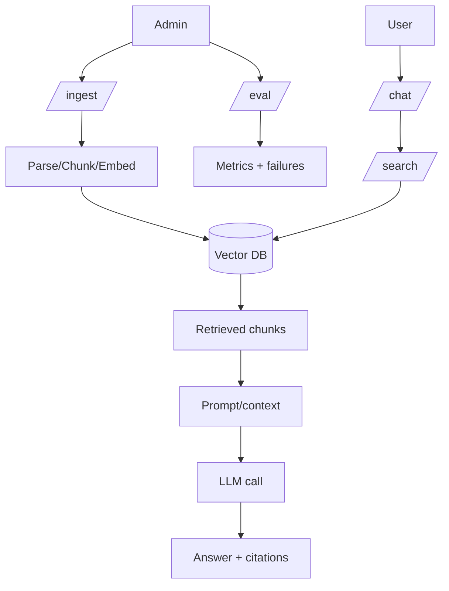

# Level 2 — Week 8: Productize RAG + Agents (Service + Front-End)

## What you should be able to do by the end of this week

- Package the system into a demo-ready service with clear endpoints and configs.
- Add admin ingestion + feedback entry points.
- Separate front-end and back-end responsibilities cleanly.

Tutorials:
 
- [tutorial.md](tutorial.md)
- [01_endpoint_map_boundaries.md](01_endpoint_map_boundaries.md)
- [02_sessions_permissions_audit.md](02_sessions_permissions_audit.md)
- [03_demo_packaging.md](03_demo_packaging.md)

Practice notebook: [practice.ipynb](practice.ipynb)

## Key Concepts (with explanations + citations)

### 1) Product boundary: API vs UI

**Mental model**:

- Keep the back end as the source of truth (retrieval, chat, eval).
- UI should call APIs and render results (including citations).

**Teach the boundary with an explicit endpoint map**:

- User endpoints:
  - `/chat`
  - `/search` (optional debug endpoint)
- Admin endpoints:
  - `/ingest`
  - `/eval`
- System endpoints:
  - `/health`

**Why this separation matters**:

- You can test back-end behavior without a UI.
- You can swap UIs without changing system logic.

Citations:

- https://fastapi.tiangolo.com/
- https://fastapi.tiangolo.com/tutorial/security/

### 2) Sessions, permissions, and cost control

**Mental model**:

- Session state changes behavior (conversation context, user settings).
- Permissions and auditing matter when ingestion or admin actions exist.

**Session design (minimum viable)**:

- Define what is stored:
  - chat history summary
  - user preferences
  - last retrieval settings
- Define lifecycle:
  - creation
  - expiration
  - deletion

**Permissions (minimum viable)**:

- Separate roles:
  - user: can chat
  - admin: can ingest/eval
- Log admin actions (who did what, when).

**Cost controls to teach early**:

- cap max tokens
- cap retrieved context size
- cap agent steps

Citations:

- https://12factor.net/
- https://developer.mozilla.org/en-US/docs/Web/HTTP/Status/401
- https://developer.mozilla.org/en-US/docs/Web/HTTP/Status/403

## Common pitfalls

- UI and API tightly coupled; hard to test independently.
- Admin endpoints without auditing or access control.

## Workshop / Implementation Plan

- Expose demo endpoints and add admin ingestion + feedback.
- Document the demo story and run commands.

## Figures (Comprehensive Overviews — Leave Blank)

### Figure A: System architecture overview

```mermaid
flowchart LR
  UI[Front-end UI] --> API[Back-end API]

  API --> H[/health/]
  API --> C[/chat/]
  API --> S[/search/]
  API --> I[/ingest/ (admin)]
  API --> E[/eval/ (admin)]

  API --> AUTH[Auth/roles]
  API --> AUDIT[Audit log]

  API --> V[(Vector DB)]
  API --> LLM[LLM provider]
```

### Figure B: Data and control flow (ingestion -> retrieval -> generation -> evaluation)



## Self-check questions

- Is the demo one-command and reproducible?
- Do you have a clear separation between admin and user endpoints?
