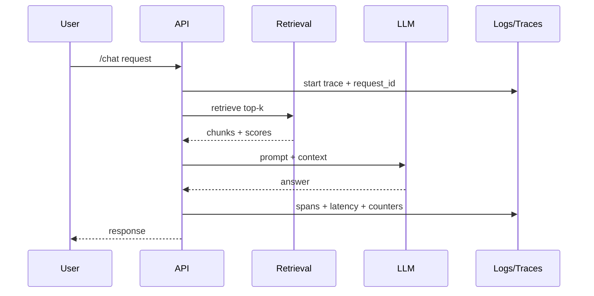

# Level 2 — Week 9: Hardening & Operations (Reliability, Security, and Scale)

## What you should be able to do by the end of this week

- Add one hardening feature: tracing, rate limiting, auth/roles, or prompt-injection defenses.
- Produce an operations checklist: what to monitor, how to debug, how to control costs.
- Define a minimal security posture appropriate for the project scope.

Tutorials:
 
- [tutorial.md](tutorial.md)
- [01_observability_tracing.md](01_observability_tracing.md)
- [02_rate_limiting_retry_policies.md](02_rate_limiting_retry_policies.md)
- [03_ops_checklist.md](03_ops_checklist.md)

## Key Concepts (with explanations + citations)

### 1) Observability and tracing

**Mental model**:

- Logs + request IDs answer “what happened?”; traces answer “where did time go?”.
- Instrument retrieval/generation/tool calls so debugging is fast.

**Minimum observability package (teach as non-negotiable)**:

- Structured logs:
  - include `request_id` and `component`
- Key counters to track (even if only printed):
  - ingestion docs/chunks
  - retrieval top_k and context length
  - model calls count
  - refusal rate

**Where tracing helps most**:

- slow retrieval queries
- slow model calls
- agent loops that run many steps

Citations:

- https://opentelemetry.io/docs/languages/python/
- https://docs.python.org/3/library/logging.html
- https://www.w3.org/TR/trace-context/

### 2) Rate limiting and abuse prevention

**Mental model**:

- Rate limits protect your service and control cost.
- Backoff and retry policies should be explicit.

**What to rate limit (in order)**:

- chat endpoint
- ingestion endpoint
- agent endpoints

**Teach “retry is not free”**:

- Retries amplify load.
- Use:
  - bounded retries
  - exponential backoff
  - idempotency where possible

Citations:

- https://developer.mozilla.org/en-US/docs/Web/HTTP/Status/429
- https://developer.mozilla.org/en-US/docs/Web/HTTP/Headers/Retry-After

## Common pitfalls

- No observability; debugging is guesswork.
- No cost controls; demos can become expensive/unpredictable.

## Workshop / Implementation Plan

- Add one hardening feature (tracing/rate limiting/auth/guardrails).
- Write an ops checklist (monitoring + debugging + cost controls).

## Figures (Comprehensive Overviews — Leave Blank)

### Figure A: System architecture overview

```mermaid
flowchart LR
  U[Clients] --> API[Service]
  API --> AUTH[Auth/roles]
  API --> RL[Rate limiter]

  API --> RET[Retrieval]
  RET --> V[(Vector DB)]
  API --> GEN[Generation]
  GEN --> LLM[LLM provider]

  API --> LOG[Structured logs]
  API --> TR[Traces (OpenTelemetry)]
  API --> MET[Metrics/counters]
```

### Figure B: Data and control flow (ingestion -> retrieval -> generation -> evaluation)



## Self-check questions

- If latency spikes, can you locate where time is spent?
- Do you have a plan to control cost and abuse?
