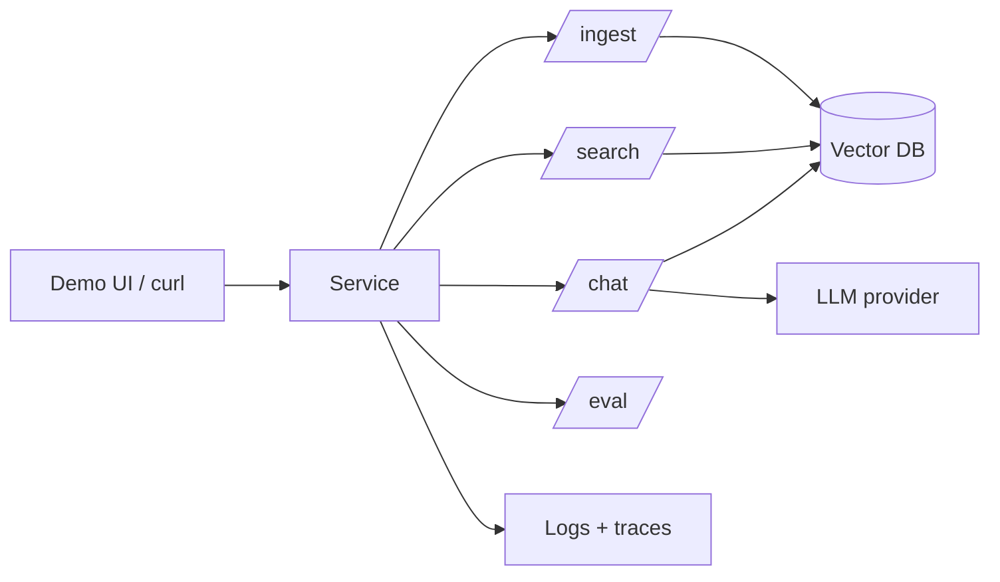
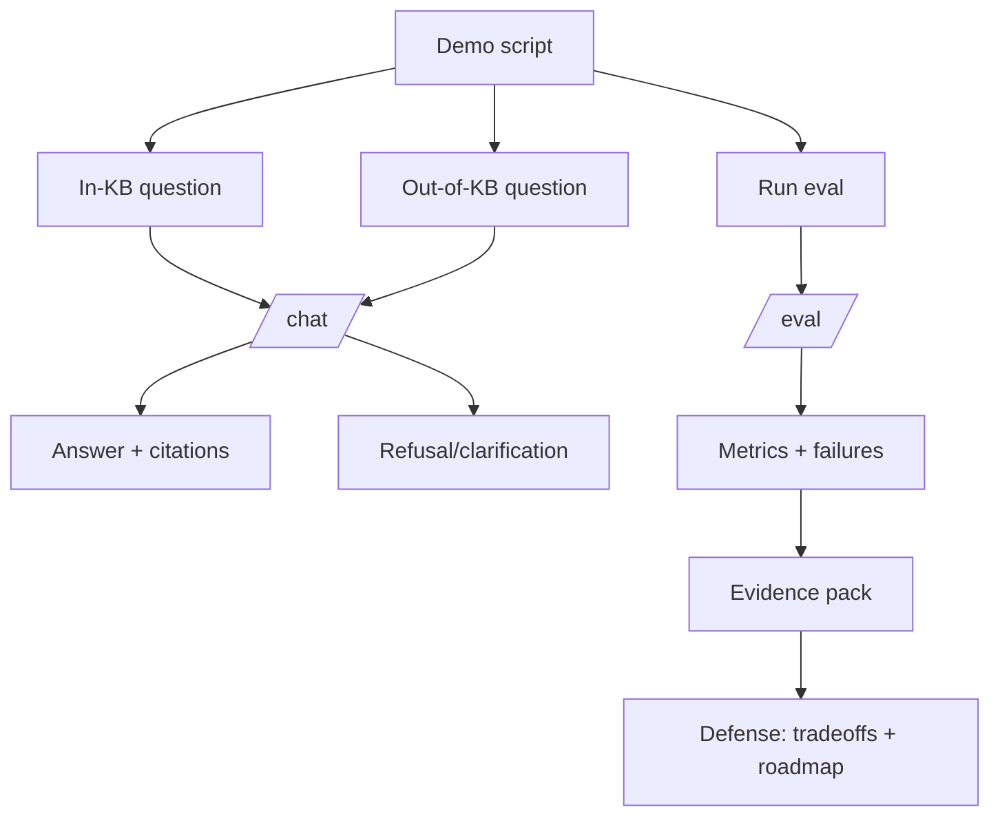

# Level 2 — Week 10: Capstone Sprint & Defense (Assessable Delivery)

## What you should be able to do by the end of this week

- Deliver a complete demo with clear story, limitations, and roadmap.
- Re-run evaluation and present evidence (metrics + failure cases).
- Defend architecture and tradeoffs (what you built and why).

Tutorials:
 
- [tutorial.md](tutorial.md)
- [01_demo_script.md](01_demo_script.md)
- [02_evidence_pack.md](02_evidence_pack.md)
- [03_defense_checklist.md](03_defense_checklist.md)

Practice notebook: [practice.ipynb](practice.ipynb)

## Key Concepts (with explanations + citations)

### 1) Demo story and defense

**Mental model**:

- A good demo shows: problem -> approach -> live run -> failure case -> evidence -> roadmap.
- Defense means you can explain tradeoffs and limitations honestly.

**Teach a standard demo script (repeatable)**:

- 60 seconds: problem framing + constraints
- 90 seconds: architecture diagram + data flow
- 2 minutes: live run (in-KB) with citations
- 1 minute: failure case (out-of-KB) showing refusal/clarification
- 1 minute: evidence (metrics + top failures)
- 30 seconds: roadmap (next 2 iterations)

**Evidence expectations (what to show)**:

- A reproducible eval script output
- A short failure list with root-cause labels
- Before/after improvement from at least one change

Citations:

- https://12factor.net/
- https://sre.google/sre-book/service-level-objectives/

## Common pitfalls

- No failure-case demo; looks unrealistic and fragile.
- No evidence of improvement (metrics/failure reduction).

## Workshop / Implementation Plan

- Prepare defense: architecture diagram + known limitations.
- Re-run eval and present improvement evidence.
- Prepare a failure-case demo and recovery story.

## Figures (Comprehensive Overviews — Leave Blank)

### Figure A: System architecture overview

### Figure B: Data and control flow (ingestion -> retrieval -> generation -> evaluation)

## Self-check questions

- Can you present one failure case and how you fixed or mitigated it?
- Can you explain the top 3 limitations and your next roadmap step?
