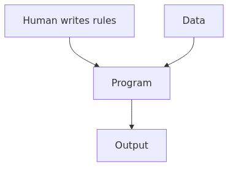
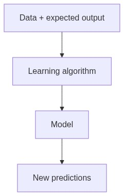
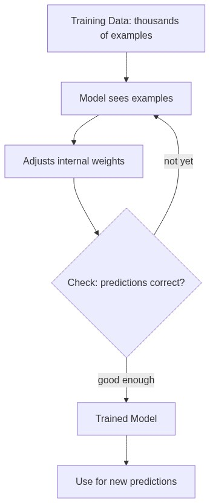
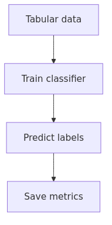
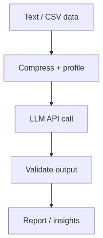
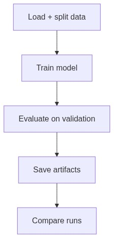
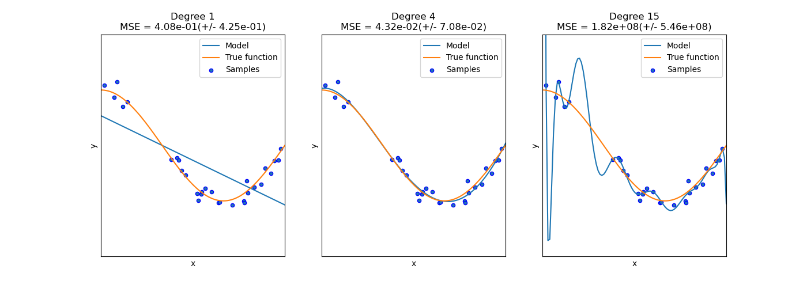

<!-- _class: lead -->

# Week 2

## The ML Training Loop + Reproducible Baselines

---

# Learning Objectives

By the end of this week, you should be able to:

- Explain why we split data into train/validation
- Train a baseline model, evaluate it, and save artifacts
- Compare two runs and write a short failure analysis (post-mortem)

---

# What is Machine Learning?

### Traditional Programming

Human writes rules → computer follows them.

---

# Machine Learning: The Key Difference

### Machine Learning

Computer **learns** rules from data + expected outputs. A **model** is the result — a program that was learned, not hand-written.

An **LLM** (Large Language Model) is a very large ML model trained on massive text data. The same ML discipline applies.

---

# What is Training?

**Training** = the process where a model learns from data by adjusting its internal parameters (weights).

- The model sees thousands of examples
- It makes predictions and checks if they're correct
- It adjusts weights to reduce errors
- Repeats until "good enough"

---

# From ML to LLM: Classical ML

Classical ML: train a model on structured data, predict labels.

Tabular data → train classifier → predict labels → save metrics.

---

# From ML to LLM: LLM-Augmented Pipeline

LLM-augmented: compress data, call LLM API, validate output.

**Different tools, same discipline.**

---

# Shared Discipline: ML ↔ LLM Training Loop

Even if you **don't train the LLM yourself**, you still need ML discipline:

- **Train/val splits** → test prompt effectiveness on held-out data
- **Artifact saving** → save prompts, outputs, configs for every run
- **Metrics comparison** → compare LLM outputs across prompt changes

---

<!-- _class: part -->

# Part 01
## The ML Training Loop

`week_02/01_training_loop.md` · `01_training_loop.ipynb`

---

# The ML Training Loop

Load → split → train → predict → compute metrics → save artifacts → compare runs.

Artifacts saved at each run:
- `config.json`
- `metrics.json`
- `model.joblib`
- `val_report.txt`

---

# The Loop: Step by Step

| Step | What you do | Why it matters |
|------|------------|---------------|
| 1. **Load data** | Read CSV into a table | Rows = examples, columns = features |
| 2. **Split train/val** | Separate learning data from test data | Prevents measuring on data the model has already seen |
| 3. **Train** | Fit a model on training data | Model learns patterns |
| 4. **Evaluate** | Predict on validation data | Honest estimate of real-world performance |
| 5. **Save artifacts** | Store config + metrics + model | Creates evidence trail for every experiment |

Even for LLM work, this disciplined loop is the basis for evaluating prompt/model changes.

---

# Overfitting: The Core Trap

**Overfitting** = the model memorizes training data instead of learning general patterns.

- Training metrics keep improving, but validation metrics **plateau or decline**
- The gap between train and validation performance reveals overfitting
- **Analogy**: a student who memorizes answers but can't solve new problems
- **LLM parallel**: a prompt that works perfectly on your test case but fails on new inputs

**Why validation split matters**: Without it, you won't detect overfitting until production failures.

---

<!-- _class: part -->

# Part 02
## Reproducibility Package

`week_02/02_reproducibility_package.md` · `02_reproducibility_package.ipynb`

---

# Reproducibility Package

Reproducibility means:
- Run the same command twice → results are **identical** (or explainably close)
- A teammate can reproduce your metrics from your command + config

### The four habits

| Habit | What it does | LLM parallel |
|-------|-------------|-------------|
| **Control randomness** | `random_state=42` | Fixed seed for sampling |
| **Parameterize runs** | `--seed`, `--max_iter` as flags | `--model`, `--temperature` as flags |
| **Save artifacts** | `config.json` + `metrics.json` | Prompt + response + latency |
| **Use run IDs** | `run_20260210_073204/` | Timestamped output folders (audit trail) |

---

# Saving Artifacts: The Audit Trail

Every run should produce a traceable folder:

| Artifact | What it answers |
|----------|----------------|
| `config.json` | "What did I try?" (parameters, seed, model) |
| `metrics.json` | "What happened?" (accuracy, F1, latency) |
| `val_report.txt` | "Detailed breakdown?" (per-class performance) |
| `model.joblib` | "Can I reproduce predictions later?" |

**For LLM work**: replace `model.joblib` with saved prompts and raw responses — same principle, different artifacts.

---

<!-- _class: part -->

# Part 03
## Experiment Comparison + Writing a Report

`week_02/03_compare_runs_report.md` · `03_compare_runs_report.ipynb`

---

# Experiment Comparison

A useful experiment changes **one variable** at a time.

| | Baseline | Variant |
|---|---------|---------|
| **seed** | 42 | 42 (same) |
| **max_iter** | 200 | **1000** (changed) |
| **accuracy** | 0.82 | 0.85 |
| **F1** | 0.79 | 0.83 |
| **training time** | 2s | 8s |

**Ask**: Did accuracy/F1 improve? Did runtime increase? Is the improvement large enough to matter?

**LLM parallel**: change one thing (model, temperature, prompt wording) and compare outputs.

---

# Experiment Report

A good report is short and structured:

| Section | What to write |
|---------|--------------|
| **Goal** | What you tried to improve |
| **Change** | Exactly what you changed (one variable) |
| **Result** | Metrics before/after |
| **Interpretation** | Why you think it changed |
| **Failure analysis** | One run that didn't work + what you learned |
| **Next experiment** | One clear idea |

**Two rules**: always include exact commands, always point to artifact folders.

---

# Common Pitfalls

| Pitfall | Fix |
|---------|-----|
| Evaluating on training data | Always compute metrics on **validation** set |
| Changing multiple variables at once | Change one thing per experiment |
| Not saving the config | Save `config.json` every run |
| Overwriting previous runs | Use per-run folders with timestamps |
| Treating one metric as truth | Include at least accuracy **and** F1 |

---

# Workshop / Deliverables

- Implement `train.py` (parameterized: `--input`, `--label_col`, `--seed`)
- Run **2 experiments**: change one hyperparameter or switch models
- Write `report.md`:
  - What you changed
  - What happened (metrics)
  - One failure analysis + your next experiment idea

---

# Self-Check Questions

- Can you explain overfitting without using equations?
- If someone runs your command twice, will results be identical or explainably close?
- Can you point to the saved artifact that proves your reported metric?
- Can you explain how ML discipline (train/val, artifacts, metrics) applies to LLM work?

---

# References

- scikit-learn getting started: https://scikit-learn.org/stable/getting_started.html
- Controlling randomness: https://scikit-learn.org/stable/common_pitfalls.html#controlling-randomness
- Model evaluation: https://scikit-learn.org/stable/modules/model_evaluation.html
- F1 score: https://en.wikipedia.org/wiki/F1_score
