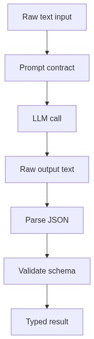
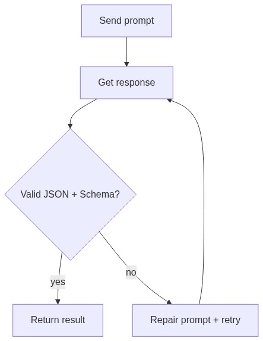

<!-- _class: lead -->

# Week 3

## LLM Fundamentals + Prompt Engineering

---

# Learning Objectives

By the end of this week, you should be able to:

- Explain tokens, context windows, and why long inputs fail
- Design prompts as contracts: clear inputs, clear output schema
- Produce valid JSON outputs and validate them programmatically

---

# What is an API?

**API** (Application Programming Interface) = a way for your code to talk to a remote service.

- You send a **request** (HTTP) with your data
- The server **processes** it and sends back a **response**
- For LLMs: you send a prompt, the server returns generated text

---

# What is a Prompt?

A **prompt** is the input text or instructions you send to an LLM.

- **System Prompt**: Global rules, persona, and constraints (e.g. "You are a helpful Python expert. Always return JSON").
- **User Prompt**: The specific question, task, or data to process.
- **Context**: Any background information (documents, chat history) needed to fulfill the task.
- It acts as an **API Contract** between your code and the AI model.

---

# What is a Large Language Model (LLM)?

An LLM is a **very large ML model** (billions of parameters) trained on massive text data.

- **Input**: text prompt (your question/instruction)
- **Output**: generated text (the model's response)
- It **predicts the next token** based on all previous tokens
- It does NOT "understand" — it generates statistically likely continuations

---

# What Happens When You Call an LLM API?

Source: Wikimedia Commons (Web API diagram.svg)

1. You **build a prompt** (system + user instructions + data)
2. Send it as an **HTTP request** to the provider
3. The model **tokenizes** your input → **generates** output tokens
4. You **parse + validate** the response

---

<!-- _class: part -->

# Part 01
## Tokens and Context Windows

`week_03/01_tokens_context.md` · `01_tokens_context.ipynb`

---

# Tokens: The Unit LLMs Process

A **token** ≈ a word fragment. Not exactly a word, not exactly a character.

| Text | Approx. tokens | Why |
|------|----------------|-----|
| `Hello world` | 2 | Common words = 1 token each |
| `Hello, world!` | 4 | Punctuation = extra tokens |
| `smushwords` | 3 | No spaces = worse tokenization |
| `你好世界` | 2–5 | Non-English = historically worse, but improving |

**Rule of thumb**: ~4 characters per token for English. Non-English text traditionally uses **2–4× more tokens** for the same meaning (though newer models like GPT-4o have improved this significantly).

**Why tokens matter**:
- Token count drives **cost** ($X per 1K tokens)
- Token count drives **latency** (more tokens = slower)
- Context window = max tokens per request

---

# Context Window: A Hard Budget

Everything must fit inside the context window.

| Model | Context window |
|-------|---------------|
| GPT-4o mini | 128k tokens |
| GPT-4o / GPT-4.5 | 128k tokens |
| Claude 3.5 / 4.5 | 200k tokens (up to 1M in beta) |

**Note**: Context window sizes evolve rapidly — these reflect current defaults as of 2025. Always check current model documentation before deployment.

---

# Why Long Inputs Fail

If you send too much text:

| Problem | What happens |
|---------|-------------|
| **Instructions ignored** | Model "forgets" early instructions |
| **Output truncated** | JSON gets cut off mid-object |
| **Constraints violated** | "Strict JSON" rules get dropped |
| **Cost explodes** | You pay for every input + output token |

**Mitigation strategies**:
- **Sampling**: only send top-k relevant docs
- **Compression**: summarize long contexts (Week 6)
- **Explicit limits**: "Return at most 10 items"

---

<!-- _class: part -->

# Part 02
## Structured Prompt Specification

`week_03/02_prompt_contracts.md` · `02_prompt_contracts.ipynb`

---

# Structured Prompt Specification

A strong prompt is not "clever wording" — it's a **specification**.

| Component | Purpose |
|-----------|--------|
| **Role** | What the model is doing |
| **Task** | What to produce |
| **Input format** | What you will provide |
| **Output schema** | Exact JSON keys and types |
| **Constraints** | No extra keys, no markdown, no commentary |
| **Fallback conditions** | When to output an error / null |

---

# Prompt Specification Flow

Raw text → prompt specification → LLM call → parse JSON → validate schema → typed result.

Each step can fail independently — separating them helps debugging.

---

# Common Prompt Failure Modes

| Failure | Cause | Fix |
|---------|-------|-----|
| Vague output format | No schema specified | Add exact JSON keys |
| Almost-JSON (single quotes) | "Return JSON" too vague | Add "ONLY valid JSON, no markdown" |
| Hallucinated values | No fallback conditions | Add "Use null if not found" |
| Dropped constraints | Too many at once | Start simple, add incrementally |
| Prose + JSON mixed | Conflicting instructions | Align system and user messages |

---

<!-- _class: part -->

# Part 03
## Structured Outputs + Validation

`week_03/03_structured_outputs_validation.md` · `03_structured_outputs_validation.ipynb`

---

# Retry with Self-Repair

When the LLM returns invalid output:
1. **Parse fails** → tell the model what went wrong, retry
2. **Schema fails** → tell the model which fields are wrong, retry
3. **Cap retries** (e.g., max 2) → uncapped retries waste money

---

# Structured Output Validation

| Step | What it checks | Failure means |
|------|---------------|---------------|
| **JSON parse** | Is it valid JSON? | Prompt issue (format) |
| **Schema validate** | Right keys and types? | Spec issue (contract) |
| **Business rules** | Values make sense? | Data or model issue |

**Tool**: Use **Pydantic** to define expected output schema — it validates types and required fields automatically.

**Key insight**: Separate parse failure from schema failure — they have different root causes and different fixes.

---

# Workshop / Deliverables

Implement `extract.py`:
- Prompt for strict JSON output
- Validate output with Pydantic schema
- Retry/repair on invalid JSON (capped)

Create a small test set with **at least 3 edge inputs**:
- Normal text (person + company present)
- Text with no entities (expect nulls)
- Ambiguous or tricky text

---

# Self-Check Questions

- Why can the model still output invalid JSON even when instructed?
- What are 3 LLM failure modes you observed?
- What's your retry limit and why?
- Does your prompt define exact keys and forbid extra text?

---

# References

- OpenAI tiktoken: https://github.com/openai/tiktoken
- Prompt engineering guide: https://www.promptingguide.ai/
- Pydantic: https://docs.pydantic.dev/latest/
- JSON Schema: https://json-schema.org/
