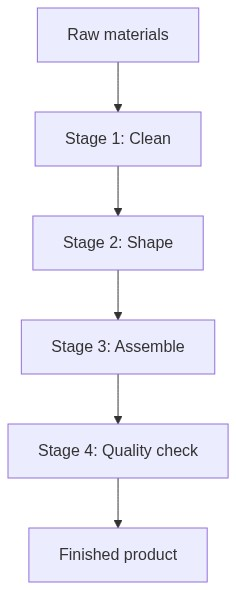
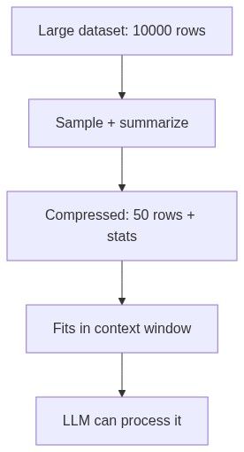
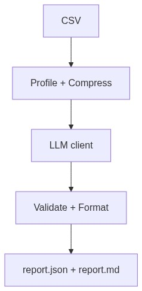
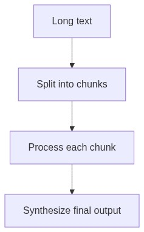

<!-- _class: lead -->

# Week 6

## Capstone Prototype (End-to-End Flow)

---

# Learning Objectives

By the end of this week, you should be able to:

- Implement the Capstone "happy path" end-to-end
- Keep prompts within limits by sampling/compressing inputs
- Produce stable artifacts: `report.json` and `report.md`

---

# What is a Data Pipeline?

A **pipeline** = a sequence of stages, each with clear inputs and outputs.

Like a factory assembly line: raw materials → clean → shape → assemble → quality check → finished product.

If one stage fails, you know exactly where to look.

---

# Why Compress Data for LLMs?

You **cannot** send a full dataset to an LLM — it won't fit in the context window. Instead:
- **Sample** representative rows
- **Summarize** statistics
- Keep under ~2000 tokens

---

# End-to-End Capstone Pipeline

CSV → Profile → Compress → LLM → Validate → Report

Each stage saves an artifact; re-run from any checkpoint.

---

# Capstone Stages

| Stage | Input | Output |
|-------|-------|--------|
| 1. **Load** | `data/*.csv` | In-memory DataFrame |
| 2. **Profile** | DataFrame | `output/profile.json` |
| 3. **Compress** | DataFrame + profile | `output/compressed.json` |
| 4. **LLM** | Prompt + compressed input | `output/llm_raw.json` |
| 5. **Report** | Validated LLM output | `output/report.json` + `report.md` |

**Key rule**: If a stage fails, previous artifacts are still saved for debugging.

---

# Token Budget Estimation

Keep compressed representation under ~2000 tokens:

| Component | Tokens |
|-----------|--------|
| System prompt | ~100–200 |
| Task instructions | ~50–100 |
| Compressed data | <2,000 |
| Output budget | ~500–1,000 |
| **Total** | Well under model limit |

If too large: reduce sample size or remove verbose fields. Rule of thumb: ~4 characters per token.

---

# Smart Sampling Strategies

**Random sampling** may miss rare-but-important cases. Choose strategy based on your analysis goal.

| Strategy | When to use | Example |
|----------|-------------|---------|
| **Random sample** | General purpose, no specific requirements | Overall data overview |
| **Stratified sample** | Must represent all categories | Balanced class representation |
| **Include extremes** | Outlier detection matters | Min/max values for anomaly detection |
| **Top-k categories** | Categorical distribution matters | Most frequent customer segments |

**Design choices**: 
- Fixed `seed` for reproducibility
- `sort_keys=True` for deterministic JSON
- Document sampling rationale in output

---

# Chunking Long Text

When text exceeds the context window: **split → process each chunk → synthesize**.

**Overlap** between chunks prevents losing information at boundaries.

---

# One-Command Runner

Your capstone should run with **one command**:

`python run_capstone.py --input data.csv`

| Flag | Purpose | Default |
|------|---------|---------|
| `--input` | Input CSV (required) | — |
| `--output_dir` | Output directory | `output` |
| `--model` | LLM model name | `gpt-4o-mini` |
| `--sample_size` | Rows to sample | 5 |
| `--seed` | Random seed | 42 |
| `--dry-run` | Skip LLM call | off |

**Dry-run mode**: test the entire pipeline without calling the LLM.

---

# Artifact Naming Convention

| File | Stage | Purpose |
|------|-------|---------|
| `01_loaded.parquet` | 1 | Loaded data |
| `02_profile.json` | 2 | Data profile |
| `03_compressed.json` | 3 | Compressed input for LLM |
| `04_llm_raw.json` | 4 | Raw LLM response |
| `05_report.json` | 5 | Final structured report |
| `05_report.md` | 5 | Human-readable report |

**Why numbered prefixes**: clear execution order, easy to see "how far did the pipeline get?"

---

# Debugging with Artifacts

| Scenario | What to do |
|----------|-----------|
| LLM call fails | Inspect `03_compressed.json`, re-run only stage 4 |
| Profile looks wrong | Check `02_profile.json` against expectations |
| Want to modify compression | Load from `01_loaded.parquet`, skip stage 1 |
| Prompt needs tuning | Read `04_llm_prompt.txt`, adjust, re-call |

**Cost control**: Don't re-call expensive LLM on every debug iteration — use saved artifacts.

---

# Workshop / Deliverables

Implement the full flow:
- CSV → profiling → sampling/compression → LLM call → `report.json` + `report.md`
- Ensure the entire pipeline runs with **one command**
- Save intermediate artifacts at each stage

**Required outputs**: `report.json` (structured) + `report.md` (human-readable)

---

# Self-Check Questions

- Can you identify which stage fails when something breaks?
- Can you re-run and get stable `report.json` fields?
- Do you save intermediate outputs to help debugging?
- Can a teammate run your pipeline without asking questions?

---

# References

- Twelve-Factor methodology: https://12factor.net/
- Neptune.ai ML Pipelines: https://neptune.ai/blog/building-end-to-end-ml-pipeline
- Valohai ML Pipeline: https://valohai.com/machine-learning-pipeline/
- tiktoken: https://github.com/openai/tiktoken
