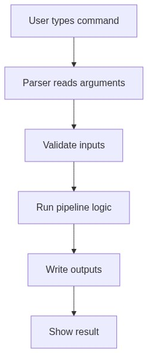
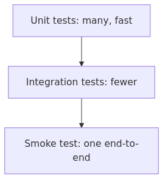

<!-- _class: lead -->

# Week 7

## Capstone Engineering & Quality

---

# Learning Objectives

By the end of this week, you should be able to:

- Finalize your CLI so the whole capstone runs with one command
- Handle errors that teach the user what to do
- Write tests that cover happy path, edge case, and failure case

---

# What is a CLI?

**CLI** (Command-Line Interface) = how users interact with your tool via terminal commands.

A good CLI makes **correct usage easy** and **incorrect usage obvious**:
- Descriptive `--help` text
- Sensible defaults  
- Clear error messages
- Exit code 0 on success, non-zero on failure (enables script chaining)

---

# The Testing Pyramid

- **Unit tests** (many): test individual functions — fast, isolated
- **Integration tests** (fewer): test components together
- **Smoke test** (one): end-to-end run — does it work at all?

For LLM projects: **mock the LLM** in unit tests, only call real APIs in smoke tests.

---

# CLI Design: Your Interface Contract

| Requirement | Why |
|-------------|-----|
| Descriptive `--help` | Users know what flags exist |
| Sensible defaults | README copy-paste works |
| Explicit inputs/outputs | No hidden assumptions |
| Clear error on invalid input | Users fix mistakes fast |

---

# Capstone CLI Flags

| Flag | Purpose | Default |
|------|---------|---------|
| `--input` | Input CSV | (required) |
| `--output_dir` | Output directory | `output` |
| `--model` | LLM model name | `gpt-4o-mini` |
| `--dry-run` | Skip LLM call for testing | off |

A good CLI makes the **common case easy** and the **edge case possible**.

---

# Config Management: Layers

Configuration priority (highest wins): **CLI args > env vars > defaults**

---

# Secrets Management

**Never** hardcode or commit API keys.

| Type | Storage | Commit? |
|------|---------|---------|
| **Secrets** (API keys, passwords) | `.env` file | NO (gitignored) |
| **Config** (model names, timeouts) | `config.json` or code | YES |

### The `.env` pattern

- `.env` (gitignored) — contains real secrets
- `.env.example` (committed) — template with placeholders
- Load with `python-dotenv` **before** `os.getenv()` calls

---

# Error Handling: Teach the User

A good error message contains: **what** went wrong, **where**, and **what to try**.

---

# Error Handling Patterns

| Pattern | When to use |
|---------|-------------|
| **Custom exceptions** | Catch by category: `InputValidationError`, `LLMCallError` |
| **Context manager** | Wrap pipeline stages for consistent logging |
| **Retry with fallback** | GPT-4 fails → try GPT-3.5 |
| **Partial success** | Collect both successes and failures in batch |
| **Checkpoint** | Save state before risky LLM call |

**Dual reporting**: short user-facing error + detailed log for debugging.

---

# Minimum 3 Test Cases

| Test type | What to test | Example |
|-----------|-------------|---------|
| **Happy path** | Normal input works | Profile a valid CSV → check row count |
| **Edge case** | Unusual but valid input | CSV with missing values → check missing counts |
| **Failure case** | Invalid input fails clearly | Nonexistent file → expect `InputValidationError` |

---

# Testing LLM Code Without Calling LLM

| Technique | What to test |
|-----------|-------------|
| **Mock LLM response** | Pipeline logic, output handling |
| **Test prompt construction** | Prompt contains key info, under token limit |
| **Test output validation** | Schema validation catches bad outputs |
| **Dry-run mode** | Full pipeline without API call |

**Key insight**: Assert **contracts** (required keys, valid types), not exact text — LLM outputs vary between calls.

---

# Coverage Targets

| Component | Target |
|-----------|--------|
| Data loading/validation | 100% |
| Profiling logic | 90%+ |
| Compression | 80%+ |
| LLM integration | 60%+ (mocked) |

Run with: `pytest --cov=src --cov-report=html`

---

# Workshop / Deliverables

- Finalize `run_capstone.py` CLI with `--help`, `--dry-run`
- Add `.env` / `.env.example` for secrets
- Implement error handling with clear messages
- Write **3+ tests**: happy path, edge case, failure case
- Run `pytest` and confirm all pass

---

# Self-Check Questions

- Can a teammate run `--help` and understand how to use your tool?
- If a beginner runs your project wrong, does the error teach them what to do?
- Can you run tests without calling real LLM APIs?
- Is `.env` in `.gitignore`?

---

# References

- Python argparse: https://docs.python.org/3/library/argparse.html
- python-dotenv: https://github.com/theskumar/python-dotenv
- Twelve-Factor config: https://12factor.net/config
- pytest docs: https://docs.pytest.org/
