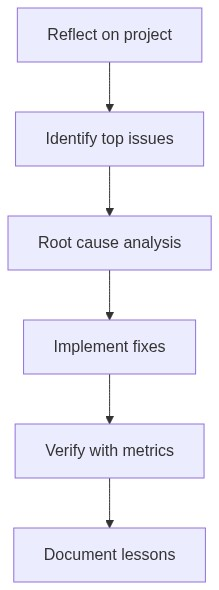
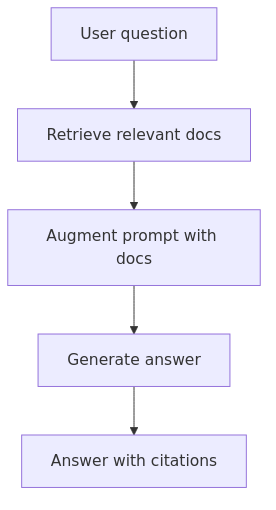
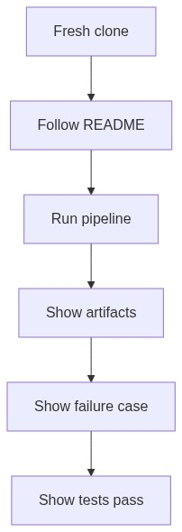

<!-- _class: lead -->

# Week 8

## Capstone Demo & Retrospective

---

# Learning Objectives

By the end of this week, you should be able to:

- Demo your capstone with a "fresh clone + README" workflow
- Write a structured retrospective with evidence (logs, artifacts, diffs)
- Identify what shifts going from Foundational Course to Level 2

---

# What is a Retrospective?

A **retrospective** = a structured reflection on what happened, why, and what to do differently.

**Key principles**:
- "Blameless" — focus on systems, not individuals
- Evidence-based — use logs, artifacts, metrics (not guesswork)
- Actionable — each finding should lead to a concrete improvement

---

# What is RAG? (Level 2 Preview)

**RAG** (Retrieval-Augmented Generation) = instead of sending all data to the LLM, first **retrieve** only the relevant parts, then **augment** the prompt with them.

This is the core pattern of Level 2 — everything you learned in this course applies directly.

---

# Demo Flow

A demo is successful when **another person can reproduce it**.

Fresh clone → follow README → run pipeline → show artifacts → show failure case → show tests pass.

---

# Demo Readiness Checklist

### Repository

- [ ] `README.md` with clear instructions
- [ ] `.gitignore` includes `.env`, `__pycache__`, output dirs
- [ ] `requirements.txt` with pinned versions
- [ ] `.env.example` with all required variables (no secrets)
- [ ] Sample data included

### Fresh clone test

- [ ] Clone to new directory
- [ ] Follow README from scratch
- [ ] All commands work without modification

---

# Demo Script (~5 min)

| Step | What to show | Time |
|------|-------------|------|
| 1. **Setup** | README, environment, `.env.example` | 2 min |
| 2. **Happy path** | `python run_capstone.py --input data/sample.csv` | 1 min |
| 3. **Artifacts** | Inspect `03_compressed.json`, `04_llm_raw.json` | 1 min |
| 4. **Failure case** | Missing file error, empty CSV error | 1 min |
| 5. **Tests** | `pytest -v` | 30 sec |

**Key rule**: Run from scratch, never edit code during demo.

---

# Retrospective: Structure

| Section | What to write |
|---------|--------------|
| **What I built** | 3-6 sentence description |
| **What went well** | With evidence (diffs, logs, metrics) |
| **What went wrong** | Top 3 issues: symptom, frequency, impact |
| **Root cause analysis** | Surface cause → deeper cause → lesson |
| **Fixes implemented** | Code changes, tests added, results |
| **Metrics summary** | Before/after comparison |
| **What I would do next** | Level 2 direction |

---

# Retrospective: What Went Wrong

For each issue, document:

| Field | Example |
|-------|---------|
| **Symptom** | Pipeline crashed with `json.JSONDecodeError` |
| **When** | First 3 test runs with real data |
| **Frequency** | 2/10 calls (20%) |
| **Evidence** | `output/04_llm_raw.json` contains partial JSON |
| **Impact** | Entire pipeline fails |

---

# Root Cause: 5 Whys Analysis

1. Why crash? → JSON parse error
2. Why parse error? → LLM returned text after JSON
3. Why extra text? → Prompt wasn't explicit about format
4. Why not explicit? → Assumed "return JSON" was enough
5. Why assume? → Didn't test with diverse inputs

**Lesson**: Each "why" reveals a deeper engineering gap — not a model gap.

---

# Retrospective: Metrics Summary

| Metric | Before | After | Change (relative) |
|--------|--------|-------|--------|
| Success rate | 70% | 98% | +28 pp (+40% relative) |
| Avg latency | 45s | 42s | -7% |
| JSON parse failures | 20% | 0% | -100% |
| Test coverage | 45% | 78% | +33 pp (+73% relative) |

**Key lessons**:
- Save intermediate artifacts at every stage
- Validate LLM outputs before using them
- Client-side rate limiting prevents 429s
- Dry-run mode enables fast iteration

---

# Preparing for Level 2

### Mindset shifts

| Foundational Course | Level 2 |
|-------------------|---------|
| Single-file scripts | FastAPI services |
| Static prompts | Dynamic prompts (RAG) |
| Manual inspection | Automated eval metrics |
| One LLM call per run | Multi-step workflows |

---

# Level 2 Preview

| Weeks | Focus | Output |
|-------|-------|--------|
| 1-2 | **RAG Foundation** | API endpoint with vector search |
| 3-4 | **Retrieval Quality** | Measurable precision/recall improvements |
| 5-6 | **Production RAG** | Service with citations + streaming |
| 7-8 | **Evaluation + Iteration** | Data-driven quality improvements |

**New concepts**: Vector databases, embeddings, semantic search, reranking, FastAPI

---

# Skills You Already Have

From this Foundational Course:

- Python functions, classes, error handling
- API integration (requests, timeouts, retries)
- JSON parsing and validation
- File I/O and data pipelines
- Testing with pytest

All of these transfer directly to Level 2.

---

# Review Before Level 2

- **Embeddings**: text → numeric vectors for similarity search
- **Async Python**: `asyncio` for concurrent API calls
- **FastAPI**: building REST APIs
- **SQL basics**: metadata filtering

---

# Level 2 Readiness Checklist

- [ ] Can write Python with type hints
- [ ] Comfortable with async/await (or ready to learn)
- [ ] Can debug with logs and artifacts
- [ ] Understand cache vs recompute tradeoffs
- [ ] Can estimate token costs and latency budgets
- [ ] Familiar with git, Docker basics, env vars
- [ ] Treat failures as data, not roadblocks
- [ ] Build evaluation before optimization

---

# Workshop / Deliverables

- **Demo**: Run your capstone live (fresh clone → README → output)
- **Retrospective**: Write `RETROSPECTIVE.md` with:
  - Top 3 issues (with evidence)
  - Root cause analysis
  - Fixes implemented (code + tests)
  - Metrics before/after
  - What you'd do next

---

# Self-Check Questions

- Can a teammate run your demo without asking questions?
- Can you explain what RAG is in one sentence?
- Do you have a failure story with evidence (logs/artifacts)?
- Are you comfortable with the Level 2 readiness checklist?

---

# References

- GitHub READMEs: https://docs.github.com/en/repositories/managing-your-repositorys-settings-and-features/customizing-your-repository/about-readmes
- Google SRE postmortem culture: https://sre.google/sre-book/postmortem-culture/
- RAG overview: https://www.pinecone.io/learn/retrieval-augmented-generation/
- FastAPI: https://fastapi.tiangolo.com/
