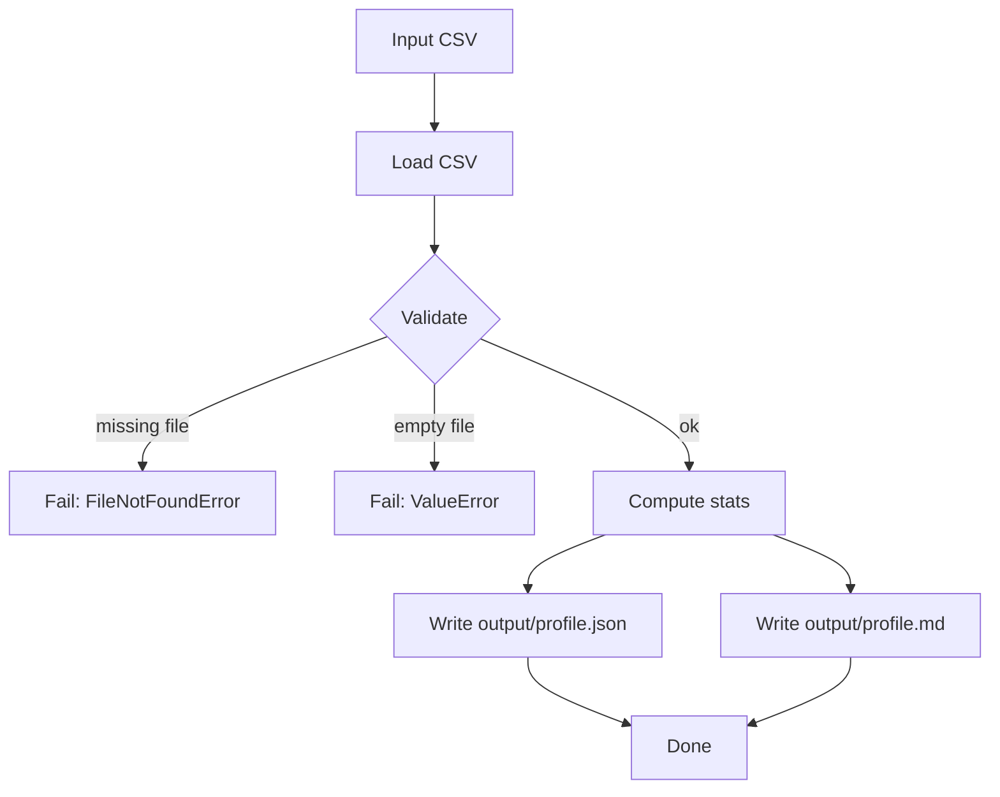

# Foundamental Course — Week 1: Environment Setup & Data Processing Basics

## Pre-study (Self-learn)

Foundamental Course assumes Self-learn is complete. If you need a refresher:

- [Pre-study index (Foundamental Course → Self-learn)](../PRESTUDY.md)
- [Self-learn — Chapter 1: Tool Preparation](../self_learn/Chapters/1/Chapter1.md)
- [Self-learn — Chapter 2: Python and Environment Management](../self_learn/Chapters/2/Chapter2.md)

## What you should be able to do by the end of this week

- Create a clean Python environment and install dependencies reliably.
- Run a project from a README on a fresh machine (or a fresh folder).
- Build a small “data profiling” script that reads a CSV and produces reproducible outputs.

### Environment setup flow

Both approaches achieve isolation; choose based on your needs:

Tutorials:
 
- [tutorial.md](tutorial.md)
- [01_environment_setup.md](01_environment_setup.md)
- [02_data_profiling_script.md](02_data_profiling_script.md)

Practice notebook: [practice.ipynb](practice.ipynb)

## Key Concepts (Self-learn refresher)

Foundamental Course assumes you already learned the fundamentals in Self-learn. If you need a refresher for this week:

- Environment management (conda/venv):
  - ../self_learn/Chapters/2/03_conda_environments.md
  - ../self_learn/Chapters/1/04_conda_environment_management.md
- Jupyter basics:
  - ../self_learn/Chapters/1/05_jupyter_interactive_computing.md
- Modules, exception handling, and JSON/file I/O patterns:
  - ../self_learn/Chapters/2/02_modules_exceptions.md

## Common pitfalls

- Running `pip install ...` outside your environment.
- Not pinning dependencies (or not recording them anywhere).
- Only sharing screenshots of errors instead of copy/paste logs.
- Writing outputs to random locations (hard to reproduce).

## Workshop / Implementation Plan

- Create environment and install dependencies.
- Implement `data_profile.py`:
  - input: `--input path/to.csv`
  - output: write files to `output/`
  - include clear errors for missing file / empty file / missing columns

### Data profiling pipeline

## Why This Matters for Learning AI

Environment setup and data processing may seem like "boring plumbing," but they are the foundation that every AI project is built on. Here's why mastering these skills early is critical:

### Reproducibility is non-negotiable in AI/ML

AI models are only as trustworthy as their ability to be reproduced. If you can't recreate the same results from the same data and code, your work has no scientific or business value. According to [AIMultiple (2026)](https://research.aimultiple.com/reproducible-ai/), *"Reproducibility is crucial for both AI research and AI applications in the enterprise — scientific progress depends on the ability of independent researchers to scrutinize and reproduce the results of a study."*

Consistent environments — same Python version, same library versions, same OS — are the first line of defense. As [GeeksforGeeks](https://www.geeksforgeeks.org/machine-learning/reproducibility-in-machine-learning/) notes, *"Reproducibility depends on consistent environments... Tools like Docker or Conda help maintain this consistency."* This is exactly why Week 1 starts with `venv` and `conda`.

### Data processing is the first step of every ML pipeline

Before any model can learn, data must be loaded, validated, and profiled. Garbage in, garbage out — if your data has missing values, wrong types, or encoding issues, no model can save you. The data profiling script you build this week teaches you to inspect data systematically, which is a habit you'll use in every AI project going forward.

### Dependency management prevents "works on my machine" disasters

Pinning dependencies in `requirements.txt` or `environment.yml` ensures that your collaborators, your CI/CD pipeline, and your future self can all run the same code. In production AI systems, a single mismatched library version can cause silent numerical differences that corrupt model outputs. As [Neptune.ai](https://neptune.ai/blog/how-to-solve-reproducibility-in-ml) explains, *"ML reproducibility hinges on metadata — you can't recreate experiments if you don't record and store metadata"* about your environment and dependencies.

### References

- [Reproducible AI: Why it Matters & How to Improve it (AIMultiple, 2026)](https://research.aimultiple.com/reproducible-ai/)
- [Reproducibility in Machine Learning (GeeksforGeeks)](https://www.geeksforgeeks.org/machine-learning/reproducibility-in-machine-learning/)
- [How to Solve Reproducibility in ML (Neptune.ai)](https://neptune.ai/blog/how-to-solve-reproducibility-in-ml)

## Self-check questions

- Can you explain the difference between a virtual environment and the system Python?
- Can you re-run your script and get the same output files from the same input?
- If someone else runs your README steps, do they succeed without extra "secret" steps?

- Can you explain the difference between a virtual environment and the system Python?
- Can you re-run your script and get the same output files from the same input?
- If someone else runs your README steps, do they succeed without extra "secret" steps?
