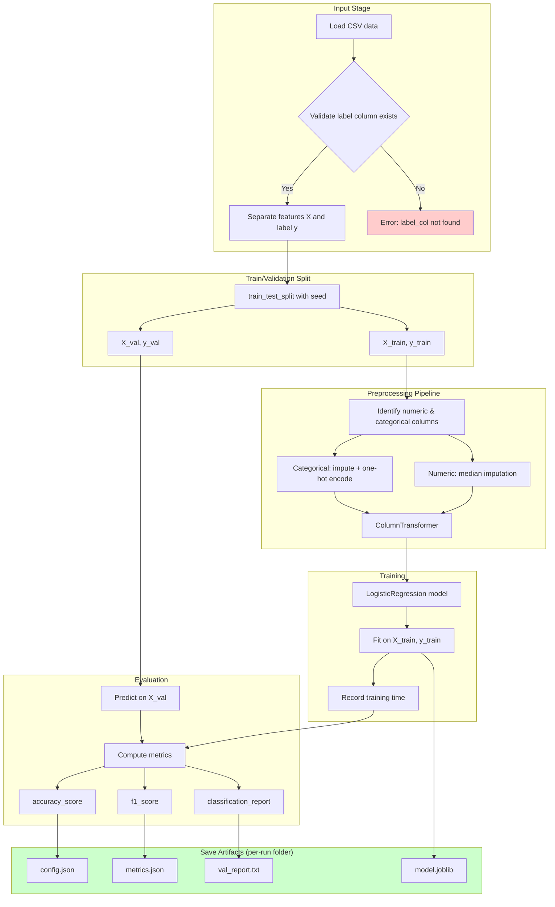

# Week 2 — Part 01: The ML training loop (split → train → evaluate → save)

### The ML training process



---

## Overview

This is the smallest ML workflow that is still “real engineering”:

1. Load data
    - What it means: read inputs into a consistent table (rows = examples, columns = features).
    - What to verify: you can print row/column counts and confirm the label column exists.
2. Split train/validation
    - What it means: separate “data you learn from” vs “data you test on”.
    - What to verify: the split is reproducible (fixed seed) and train/val are disjoint.
3. Train a baseline model
    - What it means: start with a simple model to prove the pipeline works end-to-end.
    - What to verify: training completes and you can serialize the model.
4. Evaluate on validation
    - What it means: estimate performance on unseen data.
    - What to verify: metrics are computed on validation, not on training.
5. Save artifacts
    - What it means: save evidence (config + metrics + model/report) so results are explainable later.
    - What to verify: artifacts are written into a per-run folder so reruns don’t overwrite.

Even if you later focus on LLMs, this disciplined loop is the basis for:

- evaluating prompt changes
- comparing model/provider changes
- measuring improvements

---

## Pre-study (Self-learn)

Foundations Course assumes Self-learn is complete. If you need a refresher on evaluation mindset and metrics:

- [Pre-study index (Foundations Course → Self-learn)](../PRESTUDY.md)
- [Self-learn — Evaluation metrics (accuracy/precision/recall/F1)](../self_learn/Chapters/4/02_core_concepts.md)

Why it matters here (Week 2):

- You will compare runs using saved artifacts; metrics must be computed on a hold-out split.
- Small metric changes can come from split randomness; controlling seed + saving config makes results explainable.

---

## Implementation: `train.py` (baseline classifier)

This script assumes you have a CSV with:

- feature columns
- a label column (e.g. `label`)

### Dependencies

`requirements.txt` example:

```txt
pandas==2.2.3
scikit-learn==1.5.2
joblib==1.4.2
```

Why these pieces exist:

- `scikit-learn` gives a clean split/train/eval workflow
- `joblib` persists trained models so you can re-load them later
- pinning versions reduces “works yesterday, breaks today” failures

### Code

See [train.py](./train.py) in this directory.

What makes this “engineering” (not just a notebook experiment):

- **explicit config** (`TrainConfig` saved to `config.json`)
- **metric traceability** (`metrics.json` + `val_report.txt`)
- **model persistence** (`model.joblib`)
- **per-run folder** so you can compare runs without overwriting

---

## How to run

```bash
python train.py --input data.csv --label_col label --seed 42
```

---

## What “done” looks like

You have a folder like:

- `artifacts/run_.../config.json`
- `artifacts/run_.../metrics.json`
- `artifacts/run_.../val_report.txt`
- `artifacts/run_.../model.joblib`

If those exist and your script prints metrics, you have a baseline.

If you later improve features or models, you should always be able to answer:

- “Which exact run produced this metric?”
- “What config produced that run?”
- “Can I re-load the model and reproduce predictions?”

---

## References

- scikit-learn getting started: https://scikit-learn.org/stable/getting_started.html
