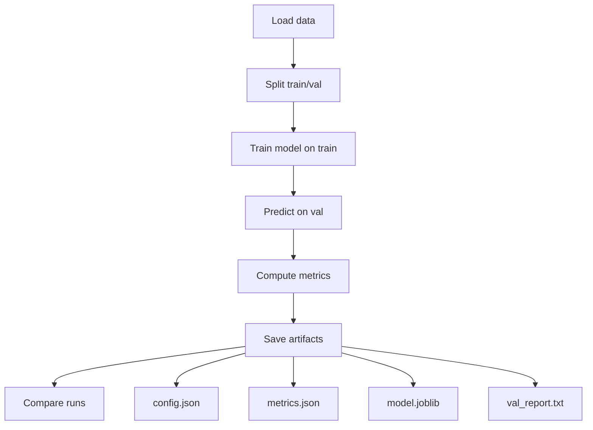
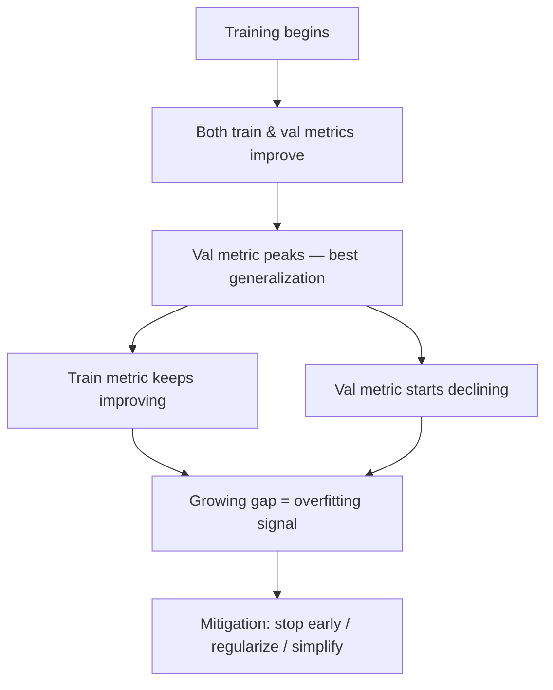

# Foundamental Course — Week 2: The ML Training Loop + Reproducible Baselines

## Pre-study (Self-learn)

Foundamental Course assumes Self-learn is complete. If you need a refresher:

- [Pre-study index (Foundamental Course → Self-learn)](../PRESTUDY.md)
- [Self-learn — Chapter 2: Python and Environment Management](../self_learn/Chapters/2/Chapter2.md)

## What you should be able to do by the end of this week

- Explain why we split data into train/validation.
- Train a baseline model, evaluate it, and save artifacts.
- Compare two runs and write a short failure retrospective.

### The ML training loop

Tutorials:
 
- [tutorial.md](tutorial.md)
- [01_training_loop.md](01_training_loop.md)
- [02_reproducibility_package.md](02_reproducibility_package.md)
- [03_compare_runs_report.md](03_compare_runs_report.md)

Practice notebook: [practice.ipynb](practice.ipynb)

## Key Concepts (Self-learn refresher)

Foundamental Course assumes you already learned the fundamentals in Self-learn. If you need a refresher for this week:

- Reproducible environments, dependencies, and basic Python project habits:
  - ../self_learn/Chapters/2/Chapter2.md
- Evaluation mindset and metrics (accuracy/precision/recall/F1):
  - ../self_learn/Chapters/4/02_core_concepts.md

### Overfitting intuition (training vs validation curves)

## Common pitfalls

- Evaluating on training data.
- Changing multiple variables at once (you can’t tell what caused improvement).
- Not saving the exact config that produced the metrics.

## Workshop / Implementation Plan

- Implement `train.py`:
  - load data
  - split train/validation
  - train a baseline classifier
  - print metrics
  - save artifacts
- Run 2 experiments:
  - change one hyperparameter OR switch models
- Write `report.md`:
  - what you changed
  - what happened
  - one failed run + your next experiment idea

## Why This Matters for Learning AI

The training loop is the beating heart of machine learning. Every ML system — from a simple spam filter to a state-of-the-art image classifier — follows the same fundamental cycle: load data, train, evaluate, iterate. Understanding this loop deeply is what separates someone who *uses* AI tools from someone who *builds* them.

### Train/validation splits prevent self-deception

If you evaluate a model on the same data it was trained on, it will look artificially good — like a student who memorizes test answers without understanding the material. The train/validation split forces you to measure how well your model *generalizes* to data it has never seen. As [Lightly.ai](https://www.lightly.ai/blog/train-test-validation-split) explains, *"The true measure of a machine learning model is how well it can generalize and make accurate predictions on completely unseen data in real-world scenarios."*

This concept is so fundamental that [Wikipedia's ML article](https://en.wikipedia.org/wiki/Training,_validation,_and_test_data_sets) states: *"The standard machine learning practice is to train on the training set and tune hyperparameters using the validation set, where the validation process selects the model with the lowest validation loss."*

### Baselines give you a reference point

You can't know if a fancy model is "good" unless you compare it to something simple. A baseline model (e.g., logistic regression, majority-class predictor) sets the floor. If your complex deep learning model barely beats a baseline, you know something is wrong — or that the problem is harder than expected.

### Saving artifacts makes experiments trustworthy

Every experiment should produce saved artifacts: the config that was used, the metrics that resulted, and the trained model itself. Without these, you're relying on memory and screenshots — which is how results get lost or misreported. According to [AIMultiple](https://research.aimultiple.com/reproducible-ai/), *"A lack of reproducibility blurs the line between scientific production and marketing"* — saving artifacts is how you stay on the science side.

### References

- [Train Test Validation Split: Best Practices & Examples (Lightly.ai)](https://www.lightly.ai/blog/train-test-validation-split)
- [Training, validation, and test data sets (Wikipedia)](https://en.wikipedia.org/wiki/Training,_validation,_and_test_data_sets)
- [Reproducible AI: Why it Matters (AIMultiple, 2026)](https://research.aimultiple.com/reproducible-ai/)

## Self-check questions

- Can you explain overfitting without using equations?
- If someone runs your command twice, will results be identical or explainably close?
- Can you point to the saved artifact that proves your reported metric?
