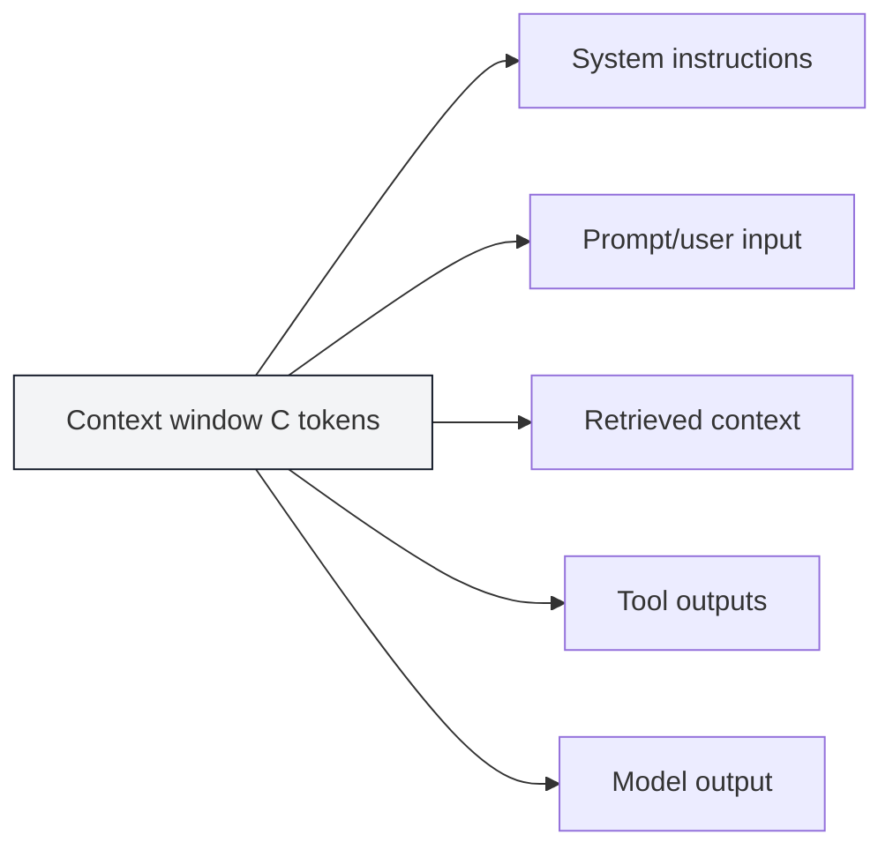
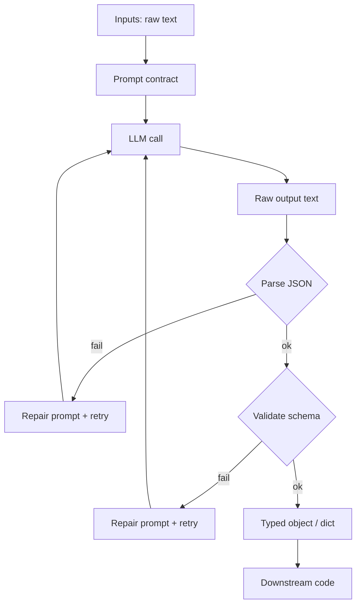

# Foundations Course — Week 3: LLM Fundamentals + Prompt Engineering

## Pre-study (Self-learn)

Foundations Course assumes Self-learn is complete. If you need a refresher:

- [Pre-study index (Foundations Course → Self-learn)](../PRESTUDY.md)
- [Self-learn — Chapter 3: AI Engineering Fundamentals](../self_learn/Chapters/3/Chapter3.md)

## What you should be able to do by the end of this week

- Explain tokens, context windows, and why long inputs fail.
- Design prompts as contracts: clear inputs, clear output schema.
- Produce valid JSON outputs and validate them programmatically.

### Context window budget

Tutorials:
 
- [tutorial.md](tutorial.md)
- [01_tokens_context.md](01_tokens_context.md)
- [02_prompt_contracts.md](02_prompt_contracts.md)
- [03_structured_outputs_validation.md](03_structured_outputs_validation.md)

Exercises are included at the end of each notebook.

## Key Concepts (Self-learn refresher)

Foundations Course assumes you already learned the fundamentals in Self-learn. If you need a refresher for this week:

- Prompt engineering fundamentals and evaluation mindset:
  - ../self_learn/Chapters/3/02_prompt_engineering_evaluation.md
- Structured outputs and validation mindset:
  - ../self_learn/Chapters/3/01_function_calling_structured_outputs.md

## Workshop / Implementation Plan

- Implement `extract.py`:
  - prompt for strict JSON
  - validate output
  - retry/repair on invalid JSON
- Create a small test set with at least 3 edge inputs

### Prompt as contract flow

## Why This Matters for Learning AI

Large Language Models (LLMs) like GPT-4, Claude, and Llama are the most transformative AI technology of this era. But using them effectively requires understanding how they actually work under the hood — not just typing questions into a chatbox. This week's content gives you that understanding.

### Tokens and context windows are the physics of LLMs

LLMs don't see words — they see *tokens* (chunks of text, roughly 3–4 characters each). Every model has a finite *context window*: the maximum number of tokens it can process in a single request. As [OpenAI's Prompt Engineering Guide](https://platform.openai.com/docs/guides/prompt-engineering) explains, *"Models can only handle so much data within the context they consider during a generation request. This memory limit is called a context window, which is defined in terms of tokens."*

If you don't understand tokens and context limits, you'll hit mysterious failures when your inputs are too long — and you won't know why. This knowledge is essential for designing systems that work reliably at scale.

### Prompt engineering is how you program LLMs

Unlike traditional software where you write explicit code, with LLMs you write *prompts* — natural language instructions that guide the model's behavior. [Anthropic](https://www.anthropic.com/engineering/effective-context-engineering-for-ai-agents) describes this shift: *"Context engineering represents a fundamental shift in how we build with LLMs... it's thoughtfully curating what information enters the model's limited attention budget at each step."*

Treating prompts as *contracts* — with clear input specifications and output schemas — is what makes the difference between a flaky demo and a production-ready system. This is a core skill for any AI engineer.

### Structured outputs bridge LLMs and code

LLMs produce free-form text, but your downstream code needs structured data (JSON, typed objects). Learning to constrain LLM outputs into valid, parseable formats — and handling failures with retry/repair logic — is one of the most practical skills in modern AI engineering. Without it, you can't build reliable pipelines that connect LLMs to databases, APIs, or user interfaces.

### References

- [Prompt Engineering Guide (OpenAI)](https://platform.openai.com/docs/guides/prompt-engineering)
- [Effective Context Engineering for AI Agents (Anthropic)](https://www.anthropic.com/engineering/effective-context-engineering-for-ai-agents)
- [Prompt Engineering (Wikipedia)](https://en.wikipedia.org/wiki/Prompt_engineering)

## Self-check questions

- Why can the model still output invalid JSON even when instructed?
- What are 3 LLM failure modes you observed?
- What's your retry limit and why?
