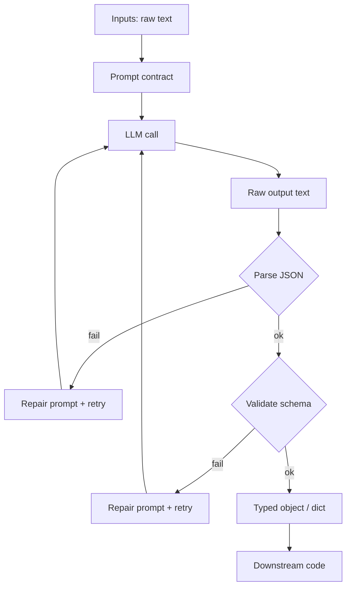
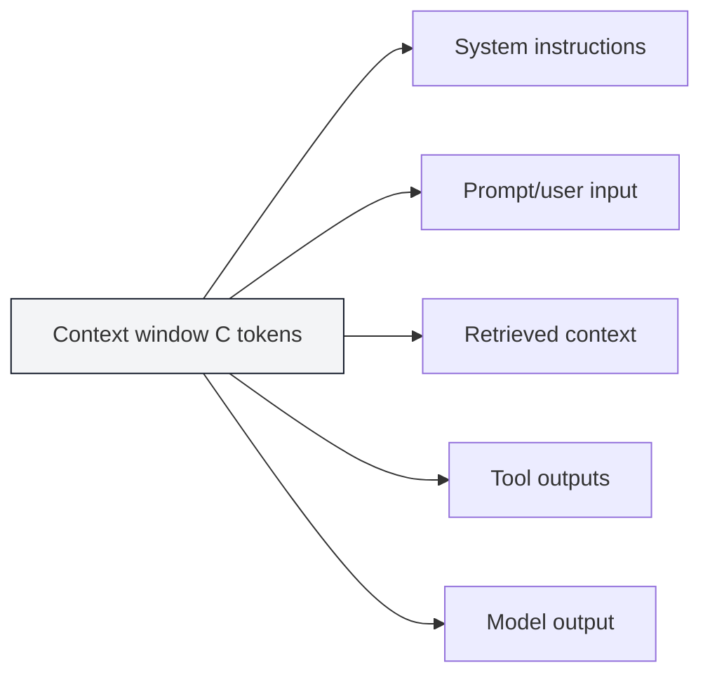

# Foundamental Course — Week 3: LLM Fundamentals + Prompt Engineering

## Pre-study (Self-learn)

Foundamental Course assumes Self-learn is complete. If you need a refresher:

- [Pre-study index (Foundamental Course → Self-learn)](../PRESTUDY.md)
- [Self-learn — Chapter 3: AI Engineering Fundamentals](../../self_learn/Chapters/3/Chapter3.md)

## What you should be able to do by the end of this week

- Explain tokens, context windows, and why long inputs fail.
- Design prompts as contracts: clear inputs, clear output schema.
- Produce valid JSON outputs and validate them programmatically.

Tutorials:
 
- [tutorial.md](tutorial.md)
- [01_tokens_context.md](01_tokens_context.md)
- [02_prompt_contracts.md](02_prompt_contracts.md)
- [03_structured_outputs_validation.md](03_structured_outputs_validation.md)

Practice notebook: [practice.ipynb](practice.ipynb)

## Key Concepts (Self-learn refresher)

Foundamental Course assumes you already learned the fundamentals in Self-learn. If you need a refresher for this week:

- Prompt engineering fundamentals and evaluation mindset:
  - ../../self_learn/Chapters/3/02_prompt_engineering_evaluation.md
- Structured outputs and validation mindset:
  - ../../self_learn/Chapters/3/01_function_calling_structured_outputs.md

## Workshop / Implementation Plan

- Implement `extract.py`:
  - prompt for strict JSON
  - validate output
  - retry/repair on invalid JSON
- Create a small test set with at least 3 edge inputs

## Figures (Comprehensive Overviews — Leave Blank)

### Figure A: Prompt as contract (inputs -> model -> validated JSON)

### Figure B: Context window budget (prompt + context + output)

## Self-check questions

- Why can the model still output invalid JSON even when instructed?
- What are 3 LLM failure modes you observed?
- What’s your retry limit and why?
