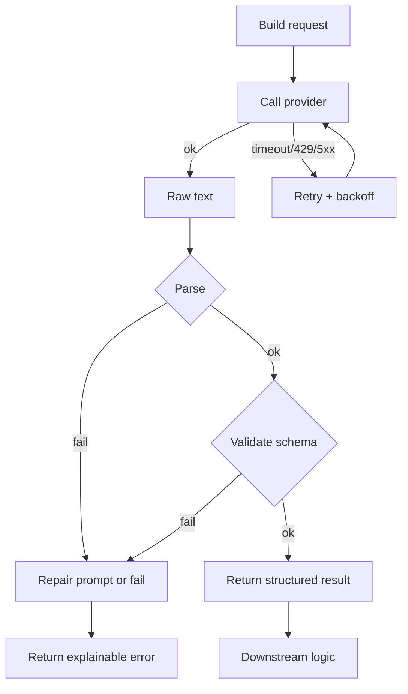
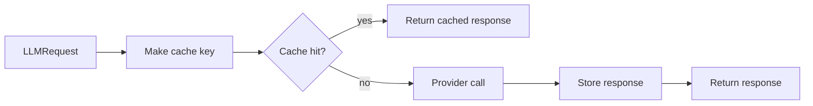

# Foundamental Course — Week 4: LLM API Engineering (Reliability & Cost)

## Pre-study (Self-learn)

Foundamental Course assumes Self-learn is complete. If you need a refresher:

- [Pre-study index (Foundamental Course → Self-learn)](../PRESTUDY.md)
- [Self-learn — Chapter 3: AI Engineering Fundamentals](../../self_learn/Chapters/3/Chapter3.md)
- [Self-learn — Chapter 5: Resource Monitoring and Containerization](../../self_learn/Chapters/5/Chapter5.md)

## What you should be able to do by the end of this week

- Implement an `llm_client.py` that is safe to reuse across projects.
- Explain why timeouts/retries/rate limits/caching exist.
- Add logging that helps you debug failures quickly.

Tutorials:
 
- [tutorial.md](tutorial.md)
- [01_timeouts_failures.md](01_timeouts_failures.md)
- [02_retries_backoff_idempotency.md](02_retries_backoff_idempotency.md)
- [03_rate_limiting.md](03_rate_limiting.md)
- [04_caching_logging.md](04_caching_logging.md)
- [05_llm_client_skeleton.md](05_llm_client_skeleton.md)

Practice notebook: [practice.ipynb](practice.ipynb)

## Key Concepts (Self-learn refresher)

Foundamental Course assumes you already learned the fundamentals in Self-learn. If you need a refresher for this week:

- Reliability mindset, prompt/tool contracts, and evaluation practices:
  - ../../self_learn/Chapters/3/Chapter3.md
- Operational concerns (monitoring, reliability, production constraints):
  - ../../self_learn/Chapters/5/Chapter5.md

## Workshop / Implementation Plan

- Implement `llm_client.py` with:
  - timeouts
  - retries + backoff
  - rate limit handling
  - simple caching
  - logs
- Add tests or a manual failure checklist:
  - forced timeout
  - forced invalid JSON

## Figures (Comprehensive Overviews — Leave Blank)

### Figure A: Reliable LLM call lifecycle (request -> retry -> parse -> validate)

### Figure B: Cache flow (request -> cache hit/miss -> provider)

## Self-check questions

- Can you show your client does not hang forever?
- Can you simulate failures and show graceful handling?
- Can you explain what information your logs provide during an incident?
