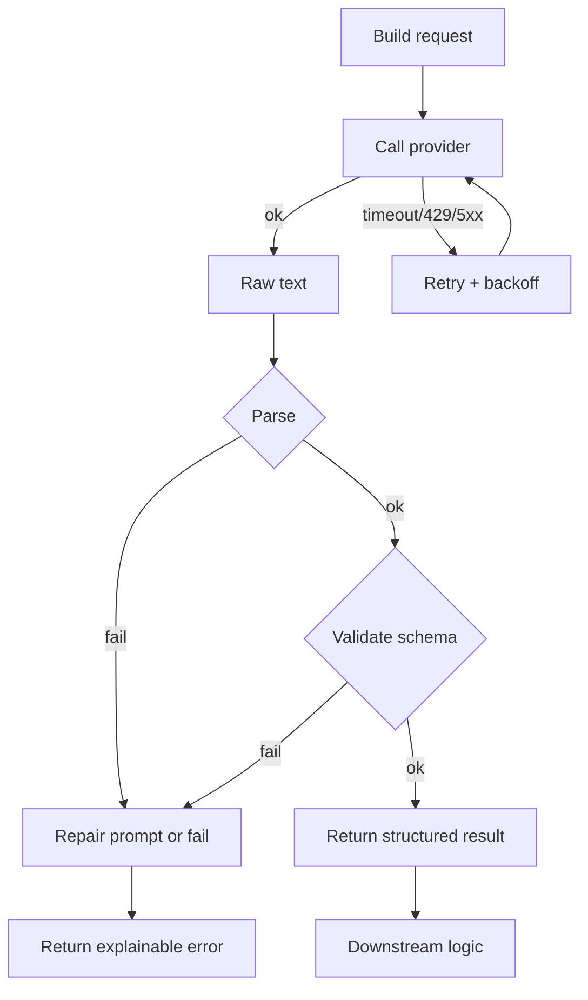
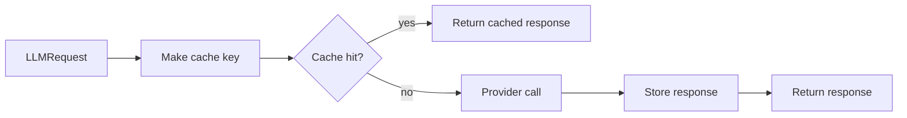

# Foundamental Course — Week 4: LLM API Engineering (Reliability & Cost)

## Pre-study (Self-learn)

Foundamental Course assumes Self-learn is complete. If you need a refresher:

- [Pre-study index (Foundamental Course → Self-learn)](../PRESTUDY.md)
- [Self-learn — Chapter 3: AI Engineering Fundamentals](../self_learn/Chapters/3/Chapter3.md)
- [Self-learn — Chapter 5: Resource Monitoring and Containerization](../self_learn/Chapters/5/Chapter5.md)

## What you should be able to do by the end of this week

- Implement an `llm_client.py` that is safe to reuse across projects.
- Explain why timeouts/retries/rate limits/caching exist.
- Add logging that helps you debug failures quickly.

### Reliable LLM call lifecycle

Tutorials:
 
- [tutorial.md](tutorial.md)
- [01_timeouts_failures.md](01_timeouts_failures.md)
- [02_retries_backoff_idempotency.md](02_retries_backoff_idempotency.md)
- [03_rate_limiting.md](03_rate_limiting.md)
- [04_caching_logging.md](04_caching_logging.md)
- [05_llm_client_skeleton.md](05_llm_client_skeleton.md)

Practice notebook: [practice.ipynb](practice.ipynb)

## Key Concepts (Self-learn refresher)

Foundamental Course assumes you already learned the fundamentals in Self-learn. If you need a refresher for this week:

- Reliability mindset, prompt/tool contracts, and evaluation practices:
  - ../self_learn/Chapters/3/Chapter3.md
- Operational concerns (monitoring, reliability, production constraints):
  - ../self_learn/Chapters/5/Chapter5.md

## Workshop / Implementation Plan

- Implement `llm_client.py` with:
  - timeouts
  - retries + backoff
  - rate limit handling
  - simple caching
  - logs
- Add tests or a manual failure checklist:
  - forced timeout
  - forced invalid JSON

### Cache flow

## Why This Matters for Learning AI

Building a cool AI demo is easy. Building an AI system that works reliably in production — under load, through failures, within budget — is the hard part. This week teaches the engineering skills that separate prototypes from products.

### LLM APIs fail — your code must handle it

Cloud-based LLM APIs (OpenAI, Anthropic, Google) are remote services that can fail in many ways: network timeouts, server errors (5xx), and rate limit rejections (HTTP 429). If your code doesn't handle these failures, your entire application crashes the moment something goes wrong. As [CodeAnt.ai](https://www.codeant.ai/blogs/llm-throughput-rate-limits) explains, *"Rate limits cause failures during peak usage, right when stability matters most... Mismatched limits force you to over-provision expensive resources or create bottlenecks."*

Implementing retries with exponential backoff is a standard pattern: instead of hammering a failing server, your code waits progressively longer between attempts, giving the service time to recover.

### Rate limits shape your architecture

Every LLM provider enforces rate limits — caps on how many requests or tokens you can use per minute. According to [TrueFoundry](https://www.truefoundry.com/blog/rate-limiting-in-llm-gateway), *"As enterprises integrate LLMs into customer-facing tools, internal copilots, and API platforms, the need for controlled and reliable access becomes critical."* Understanding rate limits isn't optional — it determines how you design batch processing, queue systems, and user-facing features.

### Caching saves money and time

LLM API calls cost real money (often per token). If your application sends the same prompt repeatedly, you're paying for the same answer over and over. A simple cache — storing responses keyed by the request — can cut costs dramatically and speed up your application. This is a fundamental optimization pattern in all software engineering, but it's especially impactful with expensive AI APIs.

### Logging is how you debug AI systems

When an LLM returns garbage, you need to know: What prompt was sent? What response came back? How long did it take? What error code was returned? Good logging answers all of these questions instantly. Without it, debugging AI failures becomes guesswork.

### References

- [Why LLM Rate Limits and Throughput Matter More Than Benchmarks (CodeAnt.ai)](https://www.codeant.ai/blogs/llm-throughput-rate-limits)
- [Rate Limiting in AI Gateway: The Ultimate Guide (TrueFoundry)](https://www.truefoundry.com/blog/rate-limiting-in-llm-gateway)
- [Tackling Rate Limiting for LLM Apps (Portkey.ai)](https://portkey.ai/blog/tackling-rate-limiting-for-llm-apps/)

## Self-check questions

- Can you show your client does not hang forever?
- Can you simulate failures and show graceful handling?
- Can you explain what information your logs provide during an incident?
