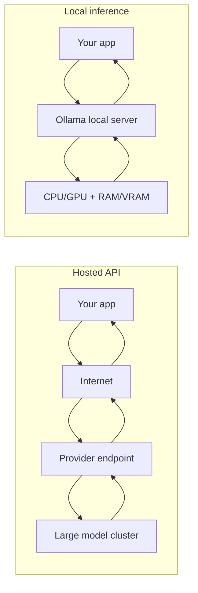
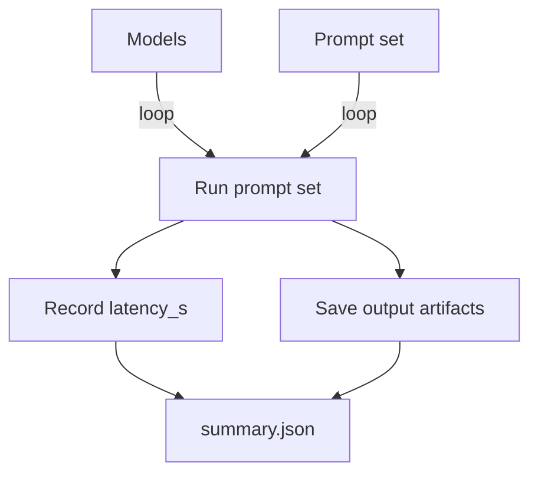

# Foundamental Course — Week 5: Local Inference (Ollama) and Model Comparison

## Pre-study (Self-learn)

Foundamental Course assumes Self-learn is complete. If you need a refresher:

- [Pre-study index (Foundamental Course → Self-learn)](../PRESTUDY.md)
- [Self-learn — Chapter 4: Hugging Face Platform and Local Inference](../../self_learn/Chapters/4/Chapter4.md)

## What you should be able to do by the end of this week

- Run at least one model locally using Ollama.
- Compare 2–3 models on the same task using a consistent benchmark script.
- Explain the practical constraints: speed, memory (VRAM/RAM), context limits, and output quality.

Tutorials:
 
- [tutorial.md](tutorial.md)
- [01_local_inference_setup.md](01_local_inference_setup.md)
- [02_ollama_http_client.md](02_ollama_http_client.md)
- [03_benchmarking_script.md](03_benchmarking_script.md)

Practice notebook: [practice.ipynb](practice.ipynb)

## Key Concepts (Self-learn refresher)

Foundamental Course assumes you already learned the fundamentals in Self-learn. If you need a refresher for this week:

- Local inference fundamentals and model/platform concepts:
  - ../../self_learn/Chapters/4/Chapter4.md

## Workshop / Implementation Plan

- Install Ollama and run one model successfully.
- Implement `benchmark_local_llm.py`:
  - define a small prompt set (5–20 items)
  - run each prompt on each model
  - record latency and store outputs
- Write a short conclusion:
  - best model for quality
  - best model for speed
  - “best-fit scenarios” (when you would choose each)

## Figures (Comprehensive Overviews — Leave Blank)

### Figure A: Hosted API vs local inference (cost, privacy, latency)

### Figure B: Benchmark summary table (models x prompts -> metrics)

## Self-check questions

- Can you run the same benchmark twice and get comparable latency distributions?
- Can you justify why one model is “best” for a specific use case?
- What is the biggest limiting factor on your machine (RAM, VRAM, CPU/GPU)?
