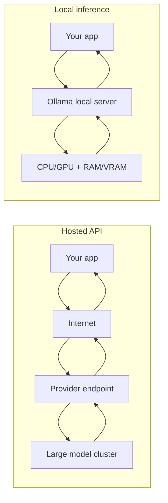
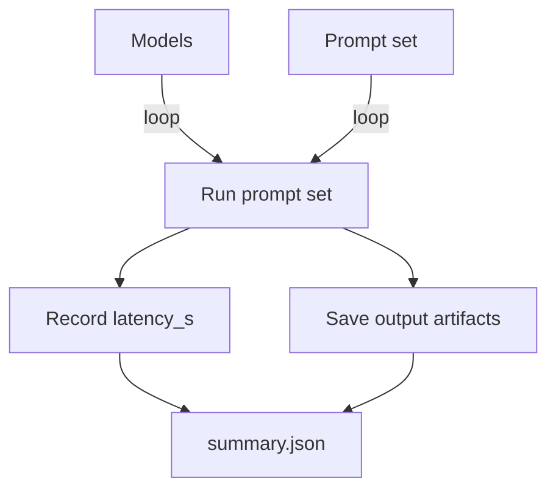

# Foundations Course — Week 5: Local Inference (Ollama) and Model Comparison

## Pre-study (Self-learn)

Foundations Course assumes Self-learn is complete. If you need a refresher:

- [Pre-study index (Foundations Course → Self-learn)](../PRESTUDY.md)
- [Self-learn — Chapter 4: Hugging Face Platform and Local Inference](../self_learn/Chapters/4/Chapter4.md)

## What you should be able to do by the end of this week

- Run at least one model locally using Ollama.
- Compare 2–3 models on the same task using a consistent benchmark script.
- Explain the practical constraints: speed, memory (VRAM/RAM), context limits, and output quality.

### Hosted API vs local inference

Tutorials:
 
- [tutorial.md](tutorial.md)
- [01_local_inference_setup.md](01_local_inference_setup.md)
- [02_ollama_http_client.md](02_ollama_http_client.md)
- [03_benchmarking_script.md](03_benchmarking_script.md)

Exercises are included at the end of each notebook.

## Key Concepts (Self-learn refresher)

Foundations Course assumes you already learned the fundamentals in Self-learn. If you need a refresher for this week:

- Local inference fundamentals and model/platform concepts:
  - ../self_learn/Chapters/4/Chapter4.md

## Workshop / Implementation Plan

- Install Ollama and run one model successfully.
- Implement `benchmark_local_llm.py`:
  - define a small prompt set (5–20 items)
  - run each prompt on each model
  - record latency and store outputs
- Write a short conclusion:
  - best model for quality
  - best model for speed
  - “best-fit scenarios” (when you would choose each)

### Benchmark summary flow

## Why This Matters for Learning AI

Cloud APIs are convenient, but they're not the only way to run AI models — and in many real-world scenarios, they're not even the best way. Learning to run models locally and benchmark them critically is an essential skill for any AI engineer.

### Local inference gives you control, privacy, and independence

When you run a model locally with tools like Ollama, your data never leaves your machine. This matters enormously in industries like healthcare, law, and finance where data privacy is non-negotiable. As [Inference.net](https://inference.net/content/ollama) explains, *"Ollama keeps sensitive data on local machines, reducing the risk of exposure through third-party cloud providers."* Local inference also means no recurring cloud costs and no dependency on internet connectivity — you can work offline, in air-gapped environments, or in regions with poor connectivity.

### Benchmarking teaches you to think critically about models

Marketing claims and leaderboard scores don't tell the whole story. A model that tops a benchmark might be too slow for your use case, too large for your hardware, or too expensive for your budget. By building your own benchmark script and measuring latency, memory usage, and output quality on *your* tasks, you learn to evaluate models based on what actually matters for your application.

As [Dev.to](https://dev.to/worldlinetech/the-ultimate-llm-inference-battle-vllm-vs-ollama-vs-zml-m97) notes in their comparison of inference engines, *"Ollama is the king of usability... unbeaten for local testing and rapid prototyping"* — but different tools excel in different scenarios. The ability to run fair comparisons and draw justified conclusions is a core data science skill.

### Understanding hardware constraints is part of AI literacy

AI models consume real resources: RAM, VRAM, CPU/GPU cycles. A 7B-parameter model might run fine on a laptop; a 70B model might not fit at all. Understanding these constraints helps you make practical decisions: Which model fits my hardware? Should I use a smaller model locally or pay for a larger one via API? These trade-offs come up in every real AI project.

### References

- [Scaling AI with Ollama and the Power of Local Inference (Inference.net)](https://inference.net/content/ollama)
- [The Ultimate LLM Inference Battle: vLLM vs. Ollama vs. ZML (Dev.to)](https://dev.to/worldlinetech/the-ultimate-llm-inference-battle-vllm-vs-ollama-vs-zml-m97)
- [Running Local LLMs with Ollama: 3 Levels (BentoML)](https://www.bentoml.com/blog/running-local-llms-with-ollama-3-levels-from-local-to-distributed-inference)

## Self-check questions

- Can you run the same benchmark twice and get comparable latency distributions?
- Can you justify why one model is "best" for a specific use case?
- What is the biggest limiting factor on your machine (RAM, VRAM, CPU/GPU)?
