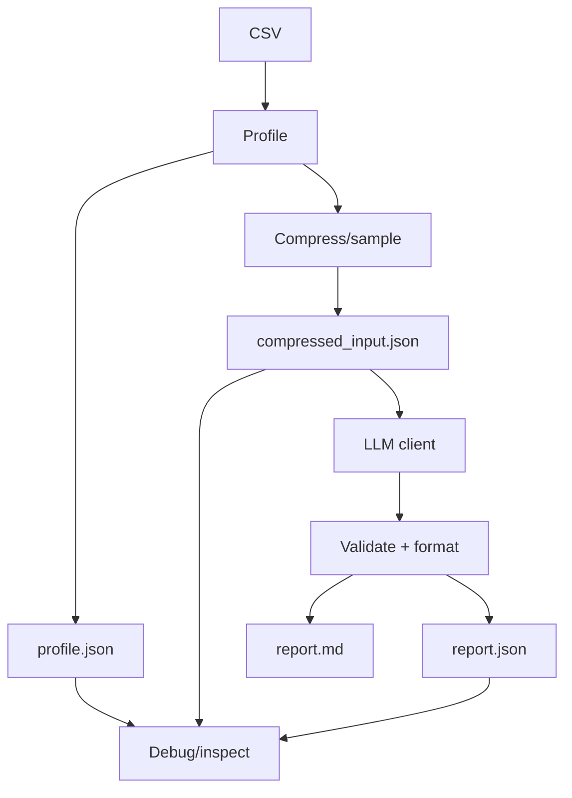

# Foundamental Course — Week 6: Capstone Prototype (End-to-End Flow)

## Pre-study (Self-learn)

Foundamental Course assumes Self-learn is complete. If you need a refresher:

- [Pre-study index (Foundamental Course → Self-learn)](../PRESTUDY.md)
- [Self-learn — Chapter 3: AI Engineering Fundamentals](../self_learn/Chapters/3/Chapter3.md)

## What you should be able to do by the end of this week

- Implement the Capstone "happy path" end-to-end.
- Keep prompts within limits by sampling/compressing inputs.
- Produce stable artifacts: `report.json` and `report.md`.

### End-to-end Capstone pipeline

Tutorials:
 
- [tutorial.md](tutorial.md)
- [01_pipeline_design.md](01_pipeline_design.md)
- [02_sampling_compression.md](02_sampling_compression.md)
- [03_chunking_synthesis.md](03_chunking_synthesis.md)
- [04_capstone_runner.md](04_capstone_runner.md)

Practice notebook: [practice.ipynb](practice.ipynb)

## Key Concepts (Self-learn refresher)

Foundamental Course assumes you already learned the fundamentals in Self-learn. If you need a refresher for this week:

- Pipeline and artifact mindset (inputs/outputs/contracts):
  - ../self_learn/Chapters/3/Chapter3.md

## Workshop / Implementation Plan

- Implement the full flow:
  - CSV -> profiling
  - sampling/compression
  - LLM call (using your `llm_client.py`)
  - build `report.json` + `report.md`
- Ensure the entire pipeline runs with one command.

## Why This Matters for Learning AI

The capstone is where everything comes together. In the real world, AI engineering is never about a single skill in isolation — it's about connecting data processing, model calls, validation, and output formatting into a reliable, end-to-end system. This week proves you can do that.

### End-to-end pipelines are how AI actually gets deployed

In production, no one runs individual scripts by hand. AI systems are *pipelines*: automated sequences of steps where the output of one stage feeds into the next. As [Neptune.ai](https://neptune.ai/blog/building-end-to-end-ml-pipeline) explains, ML pipelines let you *"achieve reproducibility in your workflow, simplify the end-to-end orchestration of multiple steps, and reduce the time it takes for data and models to move from the experimentation phase to the production phase."*

Building your capstone as a single-command pipeline teaches you to think in systems, not scripts.

### Sampling and compression are essential real-world skills

Real datasets are often too large to fit into an LLM's context window. You can't just dump a 100,000-row CSV into a prompt. Learning to sample representative subsets and compress inputs while preserving the information that matters is a critical skill. This is the same challenge faced by every RAG (Retrieval-Augmented Generation) system, every document summarizer, and every data analysis agent in production today.

### Intermediate artifacts make debugging possible

When a multi-stage pipeline produces wrong output, you need to know *which stage* broke. By saving intermediate artifacts (`profile.json`, `compressed_input.json`, `report.json`), you can inspect each stage independently. As [Valohai](https://valohai.com/machine-learning-pipeline/) notes, *"splitting the problem solving into reproducible, predefined, and executable components forces the team to adhere to a joined process"* — and makes debugging tractable instead of impossible.

### The capstone mirrors real AI engineering work

AI engineers don't just train models — they build systems that ingest data, process it, call models, validate outputs, and produce deliverables. This capstone pipeline (CSV → profiling → compression → LLM call → validated report) is a miniature version of what production AI systems look like at companies building with LLMs. Completing it demonstrates that you can own an AI project from input to output.

### References

- [How to Build an End-To-End ML Pipeline (Neptune.ai)](https://neptune.ai/blog/building-end-to-end-ml-pipeline)
- [What is a Machine Learning Pipeline? (Valohai)](https://valohai.com/machine-learning-pipeline/)
- [What Is an ML Pipeline? Stages, Architecture & Best Practices (Clarifai)](https://www.clarifai.com/blog/ml-pipeline)

## Self-check questions

- Can you identify which stage fails when something breaks?
- Can you re-run and get stable `report.json` fields?
- Do you save intermediate outputs to help debugging?
