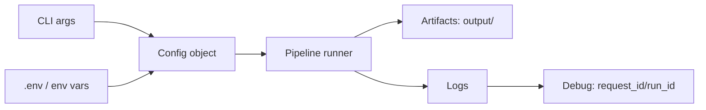
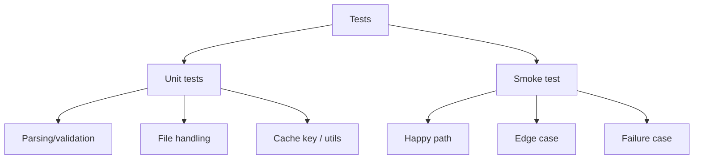

# Foundamental Course — Week 7: Capstone Engineering & Quality

## Pre-study (Self-learn)

Foundamental Course assumes Self-learn is complete. If you need a refresher:

- [Pre-study index (Foundamental Course → Self-learn)](../PRESTUDY.md)
- [Self-learn — Chapter 2: Python and Environment Management](../self_learn/Chapters/2/Chapter2.md)
- [Self-learn — Chapter 5: Resource Monitoring and Containerization](../self_learn/Chapters/5/Chapter5.md)

## What you should be able to do by the end of this week

- Improve usability: CLI flags, clear defaults, good `--help`.
- Improve reliability: better error messages, safer file handling, stable outputs.
- Add tests (or an equivalent smoke-test + manual checklist).

### CLI and config flow

Tutorials:
 
- [tutorial.md](tutorial.md)
- [01_cli_design.md](01_cli_design.md)
- [02_config_secrets.md](02_config_secrets.md)
- [03_error_handling.md](03_error_handling.md)
- [04_testing_strategy.md](04_testing_strategy.md)

Practice notebook: [practice.ipynb](practice.ipynb)

## Key Concepts (Self-learn refresher)

Foundamental Course assumes you already learned the fundamentals in Self-learn. If you need a refresher for this week:

- Modules, exception handling patterns, and file I/O habits:
  - ../self_learn/Chapters/2/02_modules_exceptions.md
- Environments, reproducibility, and operational basics:
  - ../self_learn/Chapters/2/Chapter2.md
  - ../self_learn/Chapters/5/Chapter5.md

## Workshop / Implementation Plan

- Add/upgrade:
  - CLI flags and README usage examples
  - `.env` loading for secrets
  - tests or smoke tests for 3+ cases
  - better error messages
- Stabilize output formatting (JSON field names, deterministic ordering if needed)

### Test strategy overview

## Self-check questions

- Can a teammate run your project with only the README?
- Do you have at least 3 test cases and can you execute them easily?
- When it fails, does your error message tell you what to do next?
