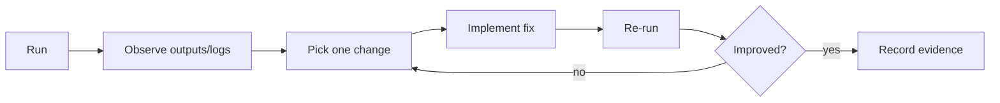

# Foundations Course — Week 8: Capstone Demo & Retrospective (Preparing for Level 2)

## Pre-study (Self-learn)

Foundations Course assumes Self-learn is complete. If you need a refresher:

- [Pre-study index (Foundations Course → Self-learn)](../PRESTUDY.md)
- [Self-learn Schedule](../self_learn/Schedule.md)

## What you should be able to do by the end of this week

- Deliver a demo-ready Capstone that runs end-to-end without “magic steps”.
- Explain your design decisions and trade-offs.
- Write a short retrospective focused on learning and iteration.

### Capstone architecture overview

```mermaid
flowchart TD
  CLI[run_capstone.py (CLI)] --> P[Pipeline orchestrator]
  P --> DP[data_profile.py]
  P --> CP[compress_table()]
  P --> LLM[llm_client.py]
  LLM --> VAL[parse + validate]
  P --> OUT[output/ artifacts]

  DP --> OUT
  CP --> OUT
  VAL --> OUT
```

Tutorials:
 
- [tutorial.md](tutorial.md)
- [01_demo_readiness.md](01_demo_readiness.md)
- [02_retrospective_template.md](02_retrospective_template.md)
- [03_preparing_for_level2.md](03_preparing_for_level2.md)

Practice notebook: [practice.ipynb](practice.ipynb)

## Key Concepts (Self-learn refresher)

Foundations Course assumes you already completed Self-learn. If you need a refresher:

- Overall roadmap and sequencing:
  - ../self_learn/Schedule.md

## Workshop / Implementation Plan

- Run the full demo script:
  - successful run
  - at least one failure-case demo
- Do a short walkthrough:
  - inputs/outputs
  - pipeline stages
  - where logs are emitted
- Write retrospective notes:
  - top 3 issues
  - fixes
  - next improvements

### Iteration loop



## Self-check questions

- Can you demo without editing code live?
- Do you have a clear failure-case story?
- Can you describe what you would add next for a Level 2-style system?
